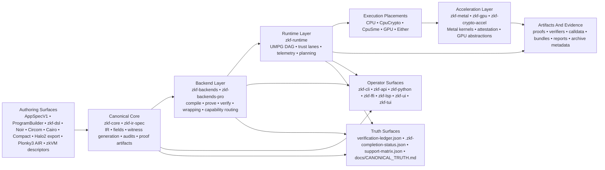

# ZirOS

> ## The Zero-Knowledge Operating System
>
> A source-backed proving workspace for authoring, importing, auditing, compiling, scheduling, accelerating, verifying, exporting, and formally accounting for zero-knowledge computation.
>
> ZirOS is the system layer that sits between application intent and raw proving machinery. You describe a statement. ZirOS owns the rest of the path: canonical IR, fail-closed audits, witness generation, backend routing, CPU/GPU scheduling, attested Metal execution, proof verification, verifier/export surfaces, runtime telemetry, and evidence-carrying artifacts.
>
> This checkout is the ZirOS core workspace and proof surface maintained in a private repository. The constitution and supporting docs also describe broader ZirOS infrastructure and release posture; this README is intentionally stricter than that broader story. It only claims what can be grounded in the current tree, its live truth surfaces, and its checked-in adjuncts.

## License Summary

ZirOS core is proprietary and private. No public source-use grant, Change Date, or automatic Apache conversion applies to the core workspace. Developers should integrate through separately licensed binary artifacts and the future `zkf-sdk` crate, which is intended to be the only Apache-2.0 public API surface.

## Live Checkout Facts

<!-- BEGIN GENERATED PRIVATE SUMMARY -->
| Fact | Current checkout value |
| --- | --- |
| Workspace crates | 22 |
| First-party Rust source lines | 346,935 tracked `.rs` lines outside `vendor/` |
| Proving backends in `support-matrix.json` | 9 total: 6 `ready`, 1 `limited`, 2 `broken` |
| Frontend families in `support-matrix.json` | 7 total: 6 `ready`, 1 `limited` |
| Gadget families in `support-matrix.json` | 11 total: 8 `ready`, 3 `limited` |
| Canonical finite fields in `zkf-core` | 7: `bn254`, `bls12-381`, `pasta-fp`, `pasta-fq`, `goldilocks`, `babybear`, `mersenne31` |
| Metal shader sources | 18 `.metal` files with 52 kernel entrypoints |
| Verified Metal manifests | 9 checked-in manifest files under `zkf-metal/proofs/manifests` |
| Verification ledger | 169 total rows, 160 `mechanized_local`, 9 `hypothesis_stated`, 0 `model_only_claim`, 0 `attestation_backed_lane`, 9 `hypothesis_carried_theorem`, 0 pending |
| Runtime proof coverage | 89 files and 1,788 functions marked complete |
| Midnight universal lane | ready across 7 contract classes; live_submit=false; blockers=3 |
| EVM secondary lane | secondary-ready across 3 target profiles; surfaces=7 |
<!-- END GENERATED PRIVATE SUMMARY -->

## Table Of Contents

- What ZirOS Is
- System Architecture
- Full Technology Stack
- Proving And Execution Surfaces
- Core ZirOS Subsystems
- Verified Boundary And Trust Model
- Scientific, Engineering, And Mission Applications
- Operator Entry Paths
- Performance, Hardware, And Storage
- Quick Start
- Documentation And Truth Surfaces
- Workspace And Technology Catalog
- Standalone Subsystems
- Distributed Proving And Cluster Scaling
- Midnight Network Integration
- License

## What ZirOS Is

ZirOS is not just a proof library and it is not just a backend wrapper. It is a workspace that treats zero-knowledge proving as an end-to-end systems problem:

- Authoring and import: `zirapp.json`, `ProgramBuilder`, Rust macros, and foreign-circuit importers.
- Truth and audit: canonical IR, field typing, nonlinear anchoring, constraint checking, and live capability surfaces.
- Execution: backend selection, UMPG graph planning, hybrid CPU/GPU scheduling, trust-lane propagation, and telemetry.
- Acceleration: Apple Silicon Metal kernels, ARM crypto paths, and GPU abstraction layers.
- Interfaces: CLI, API, Python, C FFI, LSP, UI/TUI, registry, and plugin SDK.
- Evidence: verification ledger, proof-boundary metadata, formal proof surfaces, verifier/export helpers, and public proof tools.

That is why the repository is broad. The same checkout contains:

- formal IR and live truth surfaces in `zkf-ir-spec`
- proving primitives in `zkf-core`, `zkf-gadgets`, and `zkf-backends`
- runtime and hardware layers in `zkf-runtime`, `zkf-metal`, `zkf-gpu`, and `zkf-crypto-accel`
- distributed and defensive layers in `zkf-distributed`
- operator surfaces in `zkf-cli`, `zkf-api`, `zkf-python`, `zkf-ffi`, `zkf-lsp`, `zkf-ui`, and `zkf-tui`
- application and showcase layers in `zkf-lib`, `zkCarbon`, `zk_rollup`, `private_budget_approval`, and `uccr-showcase`

The result is a workspace that can speak to cryptographers, systems engineers, compiler/tooling authors, and scientific users without pretending they all need the same interface.

## System Architecture



| Layer | Primary surfaces | Responsibility |
| --- | --- | --- |
| Authoring | `zkf-lib`, `zkf-dsl`, `zkf-frontends`, `zkf-frontend-sdk` | Build or import proof programs from native specs and foreign circuit formats |
| Canonical core | `zkf-core`, `zkf-ir-spec` | Define IR, fields, witnesses, artifacts, audits, versioning, and verification-ledger truth |
| Proof systems | `zkf-backends`, `zkf-backends-pro` | Compile/prove/verify across backend families and expose wrapping/export helpers |
| Runtime | `zkf-runtime` | Model proving as a graph, plan execution, propagate trust, and attribute acceleration |
| Hardware lane | `zkf-metal`, `zkf-gpu`, `zkf-crypto-accel` | Provide Apple Silicon execution, host-boundary checks, and accelerator abstractions |
| Distributed and defensive | `zkf-distributed` | Coordinate multi-node proving and swarm-style control surfaces |
| Operator surfaces | `zkf-cli`, `zkf-api`, `zkf-python`, `zkf-ffi`, `zkf-lsp`, `zkf-ui`, `zkf-tui` | Expose proving, verification, debugging, service, and editor-facing workflows |
| Verification and public proof tools | `zkf-verify`, `zkf-metal-public-cli`, `zkf-metal-public-proof-lib` | Narrow verifier-side and public Metal artifact surfaces |
| Examples and conformance | `zkf-examples`, `zkf-conformance`, `zkf-integration-tests` | Provide sample programs, compatibility corpus, and end-to-end regression coverage |

## Full Technology Stack

| Technology family | What is present in this checkout | Primary surfaces |
| --- | --- | --- |
| Circuit authoring | `AppSpecV1`, `BuilderOpV1`, `ProgramBuilder`, Rust DSL macros, template registry | `zkf-lib`, `zkf-dsl` |
| Frontend import | Noir ACIR, Circom R1CS/descriptor, Cairo Sierra/ZIR, Compact ZKIR/source, Halo2 export, Plonky3 AIR export, zkVM descriptors | `zkf-frontends`, `zkf-frontend-sdk` |
| Proof systems | Arkworks Groth16, Halo2 IPA, Halo2 KZG, Plonky3 STARK, Nova, HyperNova, delegated SP1/RISC Zero compatibility, Midnight external/delegated lane, wrapper helpers | `zkf-backends`, `zkf-backends-pro` |
| Curves and fields | BN254, BLS12-381, Pasta Fp/Fq, Goldilocks, BabyBear, Mersenne31 | `zkf-core`, `zkf-gadgets`, `support-matrix.json` |
| Gadgets and circuits | Poseidon, SHA-256, BLAKE3, Merkle, range, comparison, ECDSA, Schnorr, KZG, PLONK gate, boolean logic | `zkf-gadgets` |
| Runtime and scheduling | UMPG graph execution, trust lanes, unified buffer pool, runtime planning, telemetry, package workflows, runtime verification | `zkf-runtime`, `zkf-cli` |
| Hardware acceleration | Apple Silicon, Metal, unified memory, CPU crypto extensions, CPU SME lane, GPU abstraction layer | `zkf-metal`, `zkf-gpu`, `zkf-crypto-accel` |
| Formal methods | Lean 4, Rocq, F*, Verus, Kani, verification ledger, proof-boundary metadata, checked manifests | `zkf-metal/proofs`, `zkf-core/proofs`, `zkf-backends/proofs`, `zkf-ir-spec` |
| Interface stack | Clap CLI, Axum/Tower HTTP service, PyO3/maturin Python package, C FFI/cbindgen, LSP server, Ratatui/Crossterm terminal UI | `zkf-cli`, `zkf-api`, `zkf-python`, `zkf-ffi`, `zkf-lsp`, `zkf-ui`, `zkf-tui` |
| Defensive and distributed systems | Multi-node coordination, swarm identity/reputation/rule lifecycle, supply-chain audit store, benchmark harnesses | `zkf-distributed`, `supply-chain`, `benchmarks` |
| Public proof and showcase surfaces | verifier-only binary, public Metal proof helpers, carbon and rollup apps, standalone builder-spec app, Midnight showcase | `zkf-verify`, `zkf-metal-public-cli`, `tools/zkf-metal-public-proof`, `zkCarbon`, `zk_rollup`, `private_budget_approval`, `uccr-showcase` |

## Proving And Execution Surfaces

### Status Vocabulary

| Term | Meaning in this repo |
| --- | --- |
| `ready` | Shipped and available on the current host according to the live support matrix |
| `limited` | Shipped, but explicitly caveated or restricted |
| `broken` | Checked in, but unconfigured, unavailable, or not compiled into the current host surface |
| `native` | First-party proof implementation in this workspace |
| `delegated` | Compatibility lane that routes through another backend or external validation surface |

### Backends

| Backend | Status | Mode | Fields | Assurance lane | Proof semantics | Current host GPU coverage | Notes |
| --- | --- | --- | --- | --- | --- | --- | --- |
| `plonky3` | `ready` | `native` | `goldilocks`, `babybear`, `mersenne31` | `native-cryptographic-proof` | `proof-enforced-lowered-ir` | `2/2 GPU stages active on current host` | Transparent STARK path with native GPU hash/NTT coverage |
| `halo2` | `ready` | `native` | `pasta-fp` | `native-cryptographic-proof` | `proof-enforced-basic-ir` | `1/2 GPU stages active on current host` | Native Halo2 IPA lane |
| `halo2-bls12-381` | `ready` | `native` | `bls12-381` | `native-cryptographic-proof` | `proof-enforced-basic-ir` | `0/2 GPU stages active on current host` | Native Halo2 KZG lane |
| `arkworks-groth16` | `limited` | `native` | `bn254` | `native-cryptographic-proof` | `proof-enforced-basic-ir` | `3/3 GPU stages active on current host` | Support matrix marks it non-production until upstream production disclaimer is resolved |
| `nova` | `ready` | `native` | `bn254` | `native-cryptographic-proof` | `proof-enforced-basic-ir-recursive-shell` | `0/1 GPU stages active on current host` | Native recursive shell |
| `hypernova` | `ready` | `native` | `bn254` | `native-cryptographic-proof` | `proof-enforced-basic-ir-recursive-shell` | `0/1 GPU stages active on current host` | Native multifolding shell |
| `sp1` | `broken` | `delegated` | `goldilocks`, `babybear`, `mersenne31` | `attestation-backed-host-validated-lane` | `attestation-over-host-validation` | `0/0 GPU stages active on current host` | Delegated compatibility lane to `plonky3`; native backend not compiled into this host surface |
| `risc-zero` | `broken` | `delegated` | `goldilocks`, `babybear`, `mersenne31` | `attestation-backed-host-validated-lane` | `attestation-over-host-validation` | `0/0 GPU stages active on current host` | Delegated compatibility lane to `plonky3`; native backend not compiled into this host surface |
| `midnight-compact` | `broken` | `native` | `pasta-fp`, `pasta-fq` | `delegated-or-external-lane` | `external-or-delegated` | `0/0 GPU stages active on current host` | Requires external proof-server configuration or explicit compatibility delegation |

Wrapping and export surfaces: `zkf-backends-pro` carries advanced backend extensions beside the core backend crate, including strict wrapping helpers and specialized integration lanes. In this checkout those are backend extensions, not separate backend rows in `support-matrix.json`.

### Frontends

| Frontend | Status | Input forms | Notes |
| --- | --- | --- | --- |
| `noir` | `ready` | `noir-artifact-json`, `acir-program-json` | Imports ACIR plus native BlackBox metadata and Brillig hint surfaces |
| `circom` | `ready` | `circom-r1cs-json`, `zkf-program-json`, `frontend-descriptor-json` | Supports snarkjs-style import and descriptor-driven witness execution |
| `cairo` | `limited` | `sierra-json`, `cairo-descriptor-json`, `zkf-program-json`, `zkf-zir-program-json` | Supports a shipped Sierra subset; unsupported libfuncs fail closed |
| `compact` | `ready` | `compact-zkir-json`, `compact-descriptor-json`, `zkf-program-json`, `compact-source` | Midnight Compact import path with sidecar discovery |
| `halo2-rust` | `ready` | `zkf-halo2-export-json`, `zkf-halo2-export-descriptor-json` | Direct Halo2 export import |
| `plonky3-air` | `ready` | `zkf-plonky3-air-export-json`, `zkf-plonky3-air-export-descriptor-json` | Direct Plonky3 AIR export import |
| `zkvm` | `ready` | `zkvm-descriptor-json`, `zkf-program-json` | Descriptor-driven external zkVM import and execution hooks |

### Gadgets

| Gadget | Status | Supported fields | Audit status | Notes |
| --- | --- | --- | --- | --- |
| `blake3` | `ready` | `bn254`, `bls12-381`, `pasta-fp`, `pasta-fq`, `goldilocks` | `unaudited` | Hash gadget surface |
| `boolean` | `ready` | all 7 canonical fields | `informally-reviewed` | Boolean constraint helpers |
| `comparison` | `ready` | all 7 canonical fields | `unaudited` | Ordering/comparison helpers |
| `ecdsa` | `limited` | `bn254` | `informally-reviewed` | `secp256k1` and `secp256r1` verification surface |
| `kzg` | `limited` | `bn254`, `bls12-381` | `unaudited` | Pairing-check/KZG surface |
| `merkle` | `ready` | `bn254`, `bls12-381`, `pasta-fp`, `goldilocks`, `babybear`, `mersenne31` | `informally-reviewed` | Merkle inclusion helpers |
| `plonk_gate` | `ready` | all 7 canonical fields | `unaudited` | Generic PLONK gate metadata |
| `poseidon` | `ready` | `bn254`, `bls12-381`, `pasta-fp`, `goldilocks`, `babybear`, `mersenne31` | `informally-reviewed` | Algebraic hash surface |
| `range` | `ready` | all 7 canonical fields | `informally-reviewed` | Range decomposition helpers |
| `schnorr` | `limited` | `bn254` | `unaudited` | Schnorr verification surface |
| `sha256` | `ready` | `bn254`, `bls12-381`, `pasta-fp`, `goldilocks`, `babybear`, `mersenne31` | `informally-reviewed` | SHA-256 gadget surface |

## Core ZirOS Subsystems

### Canonical Core And Proof Systems

| Surface | Purpose |
| --- | --- |
| `zkf-ir-spec` | Holds IR versioning, verification ledger, and proof-boundary support metadata; it is the place that determines what the repo is allowed to claim |
| `zkf-core` | Defines `Program`, `Expr`, `Constraint`, `Signal`, `FieldElement`, witness generation, audits, diagnostics, and proof artifact data structures |
| `zkf-gadgets` | Provides the builtin gadget registry and specification metadata |
| `zkf-frontends` | Imports foreign proof DSLs and artifacts into canonical ZirOS IR |
| `zkf-backends` | Owns backend-specific compile/prove/verify implementations and wrapper/export lanes |
| `zkf-backends-pro` | Packages advanced backend extensions and specialized integration lanes beside the core backend surface |

### Runtime, Hardware, And Distributed Layers

| Surface | Purpose |
| --- | --- |
| `zkf-runtime` | Implements UMPG planning/execution, trust-lane routing, telemetry-backed scheduling, runtime policy, and unified memory management |
| `zkf-metal` | Owns Apple Silicon GPU execution, Metal kernels, attestation data, runtime bindings, and launch contracts |
| `zkf-gpu` | Defines the stable GPU abstraction interfaces used across accelerator lanes |
| `zkf-crypto-accel` | Exposes ARM CPU crypto extensions and Apple Silicon acceleration helpers |
| `zkf-distributed` | Handles multi-node coordination, worker logic, and cluster-aware proving |

### Operator, Extension, And Public Proof Surfaces

| Surface | Purpose |
| --- | --- |
| `zkf-lib` | Embeddable SDK for compile/prove/verify flows, app specs, templates, evidence, and verifier export |
| `zkf-cli` | Operator-facing CLI for proving, importing, auditing, runtime planning, cluster/swarm control, packaging, registry flows, deployment, and diagnostics |
| `zkf-api` | Axum/Tower HTTP proving-as-a-service server with auth, queueing, rate limiting, and health/capabilities endpoints |
| `zkf-python` | Python bindings for compile/prove/verify and helper flows |
| `zkf-ffi` | C-compatible FFI bridge for native embedding |
| `zkf-lsp` | LSP diagnostics, hover, goto-definition, and IR analysis |
| `zkf-ui` | Reusable terminal-rendering helpers for proof flows |
| `zkf-tui` | Standalone TUI shell and widgets built on top of UI helpers |
| `zkf-registry` | Gadget publication, listing, manifests, and dependency resolution |
| `zkf-dsl` | Rust macro surface for embedded circuit authoring |
| `zkf-frontend-sdk` | SDK for extension authors who want to add new frontend plugins |
| `zkf-verify` | Verifier-side library and standalone binary for proof inspection and checking |
| `zkf-metal-public-cli` | Narrow public CLI for Metal proof artifact handling |
| `zkf-metal-public-proof-lib` | Public proof verification helpers for the Metal artifact release lane |
| `zkf-examples` | Canonical sample programs and fixtures used across the workspace |
| `zkf-conformance` | Backend compatibility corpus and conformance checks |
| `zkf-integration-tests` | End-to-end regression coverage for cross-crate behavior |

## Verified Boundary And Trust Model

### Live Truth Surfaces

| Source | Role |
| --- | --- |
| `zkf-ir-spec/verification-ledger.json` | Authoritative proof-claim inventory |
| `.zkf-completion-status.json` | Current completion, assurance-class counts, runtime proof coverage, and checked build/test status |
| `docs/CANONICAL_TRUTH.md` | Explains how to interpret support, trust, and program-family truth |
| `support-matrix.json` | Machine-readable backend/frontend/gadget readiness on the current tree |

### Ledger And Assurance Counts

| Metric | Value |
| --- | --- |
| Total verification-ledger rows | 169 |
| `mechanized_local` rows | 160 |
| `mechanized_generated` rows | 0 |
| `hypothesis_stated` rows | 9 |
| `bounded_checked` rows | 0 |
| `assumed_external` rows | 0 |
| Pending rows | 0 |
| `mechanized_implementation_claim` | 157 |
| `attestation_backed_lane` | 0 |
| `model_only_claim` | 0 |
| `hypothesis_carried_theorem` | 12 (9 protocol + 3 attestation-honesty) |
| Trusted assumptions | 9 |
| Release grade ready | false |
| Runtime/distributed proof coverage | 89 files, 1,788 functions complete |
| Rust tests passed | 1,047 (core 200, backends 345, runtime 155, distributed 97, ir-spec 38, cli 212) |
| Proof languages | Lean 4, Rocq/Coq, Verus, F*, Kani |

### Trust Vocabulary

| Term | Meaning here |
| --- | --- |
| `mechanized` | Machine-checked theorem over a shipped implementation or tracked proof boundary |
| `attestation-backed` | Host-validated lane, not an in-circuit cryptographic proof |
| `model-only` | Theorem about a model or boundary summary, not direct end-to-end implementation correctness. **ZirOS has 0 model-only claims as of March 30, 2026** — all former model-only rows have been rebound to shipped production code. |
| `hypothesis-carried` | Mechanized theorem that still depends on explicit upstream or cryptographic hypotheses |
| `Cryptographic` | Runtime trust model for in-circuit proof-enforced outputs |
| `Attestation` | Runtime trust model for host-validated outputs |
| `MetadataOnly` | Runtime trust model for non-cryptographic metadata markers |
| `StrictCryptographic` | Required runtime lane when only cryptographic proofs are acceptable |
| `AllowAttestation` | Required runtime lane when host-validated attestations may be admitted |
| `AllowMetadataOnly` | Required runtime lane when metadata-only markers may be admitted |

`zkf-runtime/src/trust.rs` makes the weakening rule explicit: if any dependency has a weaker trust model, the node inherits the weakest.

### Groth16 Deterministic Setup Gate

Strict cryptographic lanes (compile, prove, wrap, deploy, release-safe consumption) reject dev-deterministic Groth16 artifacts unless the caller explicitly opted into dev mode. The gate is enforced end-to-end:

- `zkf-backends/src/lib_non_hax.rs`: `compiled_uses_dev_deterministic_groth16_setup()` detects 4 metadata fields; `ensure_security_covered_groth16_setup()` requires explicit dev override
- `zkf-runtime/src/api.rs`: strict runtime lanes reject dev-seeded artifacts
- `zkf-cli/src/util.rs`: `ensure_release_safe_proof_artifact()` rejects dev-deterministic artifacts at deploy/export/release-pin boundaries
- Verus proof: `groth16_deterministic_production_gate_strict_ok` proves the logical property

### Constant-Time Evaluator Bridge (F*-verified)

`zkf-core/src/proof_constant_time_bridge.rs` (350 lines) is a production-called bridge for the recursive expression evaluator, replacing the former proof-only spec. Both `eval_expr_constant_time()` and `eval_expr()` route through the bridge. F* verification via hax extraction (`Zkf_core.Proof_constant_time_bridge.fst`) proves structural visit-schedule and result-shape equivalence. The claim boundary is honest: this proves evaluator-shell schedule equivalence, not universal microarchitectural non-interference of every field operation.

### Assurance Closure (March 30, 2026)

All 16 former model-only claims rebound to shipped production code. All 3 former attestation-backed lanes converted to hypothesis-carried theorems with explicit attestation-honesty premises. 1 new theorem added: `setup.groth16_deterministic_production_gate`. The current checkout now carries the nine protocol rows honestly as hypothesis-stated because the referenced exact proof artifacts are not present in-tree. Result: **0 model-only claims, 0 attestation-backed lanes, 160/169 machine-checked with 9 protocol rows explicitly hypothesis-stated.**

### The Verified Metal Lane

| Source-backed fact | Current checkout value |
| --- | --- |
| Metal shader source files | 18 |
| Kernel entrypoints found in shipped `.metal` files | 50 |
| Generated GPU program definitions | 60 |
| Checked attestation manifests | 9 |
| Lean files under `zkf-metal/proofs/lean` | 18 |
| Verus files under `zkf-metal/proofs/verus` | 5 |
| Static entrypoint whitelist | `expected_arguments()` in `zkf-metal/src/verified_artifacts.rs` |
| Attestation chain | metallib digest, reflection digest, pipeline-descriptor digest, toolchain identity |

The Metal proof surface is deliberately split:

- `zkf-metal/proofs/lean` proves kernel-family refinement, launch safety, memory-model, and codegen truth for the admitted proof surface.
- `zkf-metal/proofs/verus` proves host-boundary launch-contract properties that are honest to claim today.
- `docs/VERIFIED_METAL_BOUNDARY.md` is the public description of that lane.

The Verus README for the Metal host boundary is explicit about scope: the current Verus lane proves non-empty typed regions, non-zero dispatch geometry, and certified BN254 route exclusions. It does not claim to prove full kernel mathematics for hash, Poseidon2, NTT, or MSM on its own.

## Scientific, Engineering, And Mission Applications

ZirOS is not confined to toy circuits. The `zkf-lib` application surface and adjacent crates expose mission, scientific, privacy, and compliance programs that treat zero-knowledge proving as a certificate layer over structured computation.

| Surface | Primary module or crate | What it certifies |
| --- | --- | --- |
| Private N-body orbital dynamics | `zkf-lib::orbital` | Structured orbital trace commitments and replayable orbital witness/program bundles |
| Satellite conjunction | `zkf-lib::satellite` | Private conjunction and maneuver-plan safety certificates |
| Multi-satellite screening | `zkf-lib::multi_satellite` | Pairwise constellation screening and mission-safety commitments |
| Powered descent | `zkf-lib::descent` | Structured descent-program constraints and witness-safe mission traces |
| Thermochemical equilibrium | `zkf-lib::thermochemical` | Gas-phase equilibrium certificate lanes with attested request/inputs surfaces |
| Real-gas state | `zkf-lib::real_gas` | Cubic equation-of-state certificate lanes over attested reduced coefficients |
| Navier-Stokes structured step | `zkf-lib::navier_stokes` | Structured finite-volume step certificates rather than unrestricted CFD claims |
| Combustion instability / Rayleigh | `zkf-lib::combustion` | Rayleigh-window and coupled low-order modal growth certificates |
| Private identity | `zkf-lib::private_identity` and `credential` CLI flows | Credential issuance, Merkle-path proofs, and privacy-preserving verification reports |
| Finance and voting examples | `financial_loan_qualification.rs`, `private_voting_commitment_pipeline.rs`, `private_identity_service_tier.rs` | Example private-policy, threshold, commitment, and eligibility flows |
| Builder-only app spec example | `private_budget_approval/` | Standalone `AppSpecV1` / `ProgramBuilder` application with prove/verify/export coverage |
| Carbon compliance showcase | `zkCarbon/` | Verifiable carbon-emission reduction proof flow |
| Rollup application experiments | `zk_rollup/` | Rollup-oriented application logic on top of ZirOS primitives |
| Midnight showcase | `uccr-showcase/` | Privacy-preserving compliance showcase for finance, medicine, and engineering on Midnight Network |

Several of these surfaces also emit evidence-oriented bundles through `zkf-lib::evidence`, including generated closure summaries, formal-evidence collection hooks, and verifier/export helpers.

## Operator Entry Paths

### For Autonomous Agent Operators

- Start with [`docs/agent/README.md`](docs/agent/README.md).
- Public install target: `npm install -g @ziros/agent` then `ziros setup`.
- Source contributor path: `bash setup/agent/bootstrap.sh` then `ziros setup`.
- Run `ziros-agentd` first, then operate through `ziros agent ...` or the thin
  `ZirOSAgentHost` shell.
- Inspect persistent local learning through `ziros agent memory ...` instead of
  assuming the agent is stateless.

### For Cryptographers

- Start with `support-matrix.json`, `zkf-ir-spec/verification-ledger.json`, `.zkf-completion-status.json`, and [`docs/CANONICAL_TRUTH.md`](docs/CANONICAL_TRUTH.md).
- Read `zkf-backends`, `zkf-backends-pro`, and `zkf-verify` for backend and verifier surfaces.
- Read [`docs/agent/SETUP_APPLE_SILICON.md`](docs/agent/SETUP_APPLE_SILICON.md) and `zkf-metal/proofs/*` for the Apple Silicon GPU lane.

### For Engineers And Programmers

- Start with `zkf-lib`, `ProgramBuilder`, `AppSpecV1`, and `zkf-cli`.
- Use `zkf-api`, `zkf-python`, or `zkf-ffi` if you need embedding instead of shell workflows.
- Use `zkf-examples`, `zkf-conformance`, and `zkf-integration-tests` to see complete end-to-end flows.
- If you want the daemon-backed operator path, start with [`docs/agent/README.md`](docs/agent/README.md).

### For Scientists, Physicists, Chemists, And Mathematicians

- Start with the `zkf-lib::orbital`, `satellite`, `multi_satellite`, `descent`, `thermochemical`, `real_gas`, `navier_stokes`, and `combustion` modules.
- Treat these as certificate lanes over shipped discrete models, not as claims about unrestricted theory.
- The canonical truth file is explicit about those scope boundaries and is part of the public story.

### For App And Platform Builders

- Start with `zkf-dsl`, `zkf-frontend-sdk`, `zkf-registry`, `zkf-lsp`, `zkf-ui`, and `zkf-tui`.
- Use `zkf-cli app ...`, `package ...`, `runtime ...`, and `registry ...` to scaffold, package, and inspect flows.
- Use `zkf-metal-public-cli` and `zkf-metal-public-proof-lib` when you need a narrower public proof surface than the full workspace.

## Performance, Hardware, And Storage

### Apple Silicon And Execution Planning

| Runtime fact | Current checkout evidence |
| --- | --- |
| Hardware profiles | `M1`, `M2`, `M3`, `M4`, `A17Pro`, `A18`, `A18Pro`, `VisionPro`, `CpuOnly` in `zkf-runtime/src/trust.rs` |
| Device placements | `Cpu`, `Gpu`, `CpuCrypto`, `CpuSme`, `Either` in `zkf-runtime/src/graph.rs` |
| GPU-capable stage keys | `ntt`, `lde`, `msm`, `poseidon-batch`, `sha256-batch`, `merkle-layer`, `fri-fold`, `fri-query-open` |
| Unified memory classes | `HotResident`, `EphemeralScratch`, `Spillable` in `zkf-runtime/src/memory.rs` |
| Neural Engine role | advisory control plane only; proof validity does not depend on model output |

### Neural Engine Control Plane

The repo ships a Neural Engine control-plane story through runtime and documentation surfaces:

- retraining and telemetry commands in `zkf-cli`
- model-operations docs in [`docs/NEURAL_ENGINE_OPERATIONS.md`](docs/NEURAL_ENGINE_OPERATIONS.md)
- Apple-Silicon agent setup docs in [`docs/agent/SETUP_APPLE_SILICON.md`](docs/agent/SETUP_APPLE_SILICON.md)
- explicit canonical-truth language that model output is advisory, not proof-validity truth

### Post-Quantum Cryptographic Surfaces

ZirOS ships NIST-standardized post-quantum cryptography across the proving, identity, and communication layers.

| Surface | Algorithm | Standard | Security Level | Status |
| --- | --- | --- | --- | --- |
| STARK proofs (Plonky3) | FRI + hash-based Merkle commitment | Information-theoretic | Post-quantum (no elliptic curves) | `ready` |
| Swarm peer identity | ML-DSA-87 (hybrid with Ed25519) | NIST FIPS 204 | Level 5 (AES-256 equivalent) | `ready` |
| Credential issuance | ML-DSA-87 signature bundles | NIST FIPS 204 | Level 5 | `ready` |
| Proof-origin attestation | ML-DSA-87 on proof artifacts | NIST FIPS 204 | Level 5 | `ready` |
| Epoch key exchange | ML-KEM-1024 (hybrid with X25519) | NIST FIPS 203 | Level 5 | `ready` |
| Gossip encryption | ChaCha20-Poly1305 (256-bit symmetric) | — | Post-quantum (symmetric) | `ready` |
| Key derivation | HKDF-SHA384 | CNSA 2.0 compliant | Post-quantum | `ready` |
| Credential KDF | Argon2id + SHA-256 | — | Post-quantum (symmetric) | `ready` |

CNSA 2.0 alignment: ML-DSA-87 for digital signatures, ML-KEM-1024 for key establishment, SHA-384 for key derivation, and ChaCha20-Poly1305 (AES-256 equivalent) for authenticated encryption. The Plonky3 STARK backend provides post-quantum proofs without trusted setup; Groth16, Halo2, and Nova backends remain classical (elliptic-curve-based) and are explicitly labeled as such.

The hybrid identity scheme (`HybridEd25519MlDsa87`) requires both Ed25519 and ML-DSA-87 signatures to verify. If either algorithm is broken, the other provides continued security. The hybrid key exchange combines X25519 and ML-KEM-1024 shared secrets through HKDF-SHA384; compromising one algorithm does not compromise the derived key.

Implementation surface: `libcrux-ml-dsa` v0.0.8 for ML-DSA-87, `libcrux-ml-kem` v0.0.8 for ML-KEM-1024, `chacha20poly1305` for AEAD, `hkdf` with SHA-384 for key derivation. Private keys are stored in iCloud Keychain on macOS (Secure Enclave protected, synced with Advanced Data Protection) or in file-based storage with restricted permissions on other platforms.

Post-quantum backend classification:

| Backend | Post-Quantum | Basis |
| --- | --- | --- |
| `plonky3` | Yes | FRI polynomial commitment is hash-based; no number-theoretic assumptions |
| `arkworks-groth16` | No | BN254 elliptic curve pairings; vulnerable to Shor's algorithm |
| `halo2` | No | Pasta curve IPA; vulnerable to Shor's algorithm |
| `halo2-bls12-381` | No | BLS12-381 KZG; vulnerable to Shor's algorithm |
| `nova` / `hypernova` | No | Pallas/Vesta curves; vulnerable to Shor's algorithm |
| STARK-to-SNARK wrapping | Outer: No | Inner STARK is post-quantum; outer Groth16 wrapper is classical |

For end-to-end post-quantum proof generation, use `--backend plonky3` without wrapping.

### iCloud-Native Storage Architecture

ZirOS implements iCloud Drive as the persistent storage layer and iCloud Keychain as the key management layer. The local SSD operates as a transparent cache. Artifacts are written directly to iCloud on creation; macOS handles upload, sync, cross-device availability, and automatic local eviction under storage pressure.

Persistent state directory: `~/Library/Mobile Documents/com~apple~CloudDocs/ZirOS/`

| Directory | Contents | Access pattern |
| --- | --- | --- |
| `proofs/{app}/{timestamp}/` | Proof artifacts organized by application and proving timestamp | Write on prove, read on verify/inspect |
| `traces/{app}/{timestamp}/` | UMPG execution telemetry, GPU attribution, security verdicts | Write on prove |
| `verifiers/{app}/{timestamp}/` | Solidity verification contracts | Write on export |
| `reports/{app}/{timestamp}/` | Mission assurance and proving reports | Write on export |
| `audits/{app}/{timestamp}/` | Circuit security audit results | Write on audit |
| `telemetry/` | Neural Engine training records | Write per job, read on retrain |
| `swarm/` | Threat patterns, detection rules, reputation logs, entrypoint observations, attestation chains | Read/write per job |

Key management: persistent private keys (Ed25519, ML-DSA-87, proving keys, credential keys) are stored in iCloud Keychain with `kSecAttrSynchronizable = true` and Secure Enclave protection on each device. Keys sync across Apple devices signed into the same Apple ID with Advanced Data Protection enabled. Ephemeral keys (X25519, ML-KEM-1024 epoch keys) remain in-process memory only and are never persisted.

Witness handling: witnesses contain every private input to a circuit in plaintext. They are generated in the local cache (`~/.zkf/cache/`), used for proving, and deleted immediately after proof verification. Witnesses are never written to iCloud. This is the enforcement mechanism that preserves the zero-knowledge property on the storage layer.

Local cache: `~/.zkf/cache/` holds ephemeral computation artifacts (witnesses during proving, build intermediates, active proving keys pulled from iCloud for a session). The cache is expendable; its contents can be rebuilt from iCloud or regenerated from source.

Device-adaptive profiles:

| Profile | SSD capacity | Warning threshold | Critical threshold | Monitor interval |
| --- | --- | --- | --- | --- |
| Constrained | up to 300 GB | 30 GB | 15 GB | 30 minutes |
| Standard | 301 to 600 GB | 50 GB | 25 GB | 1 hour |
| Comfortable | 601 GB to 1.2 TB | 100 GB | 50 GB | 1 hour |
| Generous | above 1.2 TB | 200 GB | 100 GB | daily |

Cross-device operation: install ZirOS on any Mac, sign in with the same Apple ID, and all keys, proofs, telemetry, models, and swarm state are immediately available. No manual file transfer, no USB drives, no configuration beyond `ziros doctor`.

Storage and key commands:

```bash
ziros storage status --json    # iCloud sync state, local cache usage, key inventory
ziros storage evict            # Release locally cached iCloud files to free SSD space
ziros storage warm             # Pre-fetch frequently used files into local cache
ziros storage install          # Install the hourly macOS launchd cache-management agent
ziros keys list --json         # Enumerate all keys across Keychain and file backends
ziros keys audit --json        # Report key age, rotation status, sync health, permissions
ziros keys rotate <id>         # Generate new key material and retire the previous key
```

On non-macOS platforms, the iCloud layer falls back to local file storage at `~/.zkf/` with the same directory structure and access patterns.

### Checked Build And Test Truth

`.zkf-completion-status.json` records the current checked build/test posture for this tree:

- build truth dated March 30, 2026 includes `cargo build --workspace`
- test truth dated March 30, 2026 includes 1,047 tests across 6 crates: `cargo test -p zkf-core --lib` (200), `cargo test -p zkf-backends --lib` (345), `cargo test -p zkf-runtime --lib` (155), `cargo test -p zkf-distributed --lib` (97), `cargo test -p zkf-ir-spec --lib` (38), `cargo test -p zkf-cli` (212)
- proof runner truth: `run_rocq_proofs.sh`, `run_verus_workspace.sh` (3 workspaces), `run_verus_sovereign_economic_defense_proofs.sh`, `run_verus_reentry_assurance_proofs.sh`, `make -C zkf-core/proofs/fstar verify`
- truth surface sync: `python3 scripts/generate_verification_status_artifacts.py --check` passes

## Quick Start

### Agent-First Apple Silicon Setup

If you want the autonomous ZirOS operator, start with the dedicated guide set:

1. [`docs/agent/README.md`](docs/agent/README.md)
2. [`docs/agent/QUICKSTART.md`](docs/agent/QUICKSTART.md)
3. `ziros setup`

Source contributors can still use `bash setup/agent/bootstrap.sh`, which now
installs managed binaries under `~/.ziros/bin/` and compatibility symlinks in
`~/.local/bin/`.

### npm Install (Apple Silicon macOS, recommended)

```bash
npm install -g @ziros/agent
ziros setup
ziros
```

This public path is npm-first and does not require a Rust toolchain unless you
want to build ZirOS from source.

### Source Build

```bash
git clone https://github.com/AnubisQuantumCipher/ziros.git
cd ziros
./zkf-build.sh --release -p zkf-cli
./target-public/release/zkf-cli doctor
./target-public/release/zkf-cli capabilities
```

On Apple Silicon, `./zkf-build.sh --release -p zkf-cli` also builds the release
`zkf-cli` binary with `metal-gpu`, so the shipped macOS artifact is Metal-capable
before strict certification is applied.

### Inspect What The Current Binary Claims

```bash
ziros capabilities
ziros support-matrix
ziros frontends --json
ziros doctor --json
ziros metal-doctor --json
```

### Scaffold, Audit, Compile, Prove, Verify

```bash
ziros app templates
ziros audit --program docs/examples/fixtures/epa/zirapp.json --backend arkworks-groth16 --json
ziros compile --spec docs/examples/fixtures/epa/zirapp.json --backend arkworks-groth16 --out /tmp/epa.compiled.json --allow-dev-deterministic-groth16
ziros prove --program docs/examples/fixtures/epa/zirapp.json --inputs docs/examples/fixtures/epa/inputs.compliant.json --backend arkworks-groth16 --out /tmp/epa.proof.json --allow-dev-deterministic-groth16
ziros verify --program docs/examples/fixtures/epa/zirapp.json --artifact /tmp/epa.proof.json --backend arkworks-groth16 --allow-dev-deterministic-groth16
```

### Midnight Proof Server

```bash
# Start ZirOS's GPU-accelerated Midnight proof server
zkf midnight proof-server serve --port 6300 --engine umpg --json

# Health check
curl http://127.0.0.1:6300/health
# → {"status":"ok","timestamp":"..."}

# Readiness check (load-balancer friendly)
curl http://127.0.0.1:6300/ready
# → {"status":"ok","jobsProcessing":0,"jobsPending":0,"jobCapacity":2}
```

### Midnight Developer Platform

```bash
# Serve the Compact admission gateway
zkf midnight gateway serve --port 6311 --json

# Inspect pinned template metadata
zkf midnight templates --json

# Diagnose the full Midnight toolchain lane
zkf midnight doctor --json --network preprod

# Analyze Compact disclosure boundaries from an imported program
zkf midnight disclosure --program /tmp/my-contract.program.json --json

# Fix pinned Midnight package drift for an existing project
zkf midnight resolve --network preprod --project /tmp/my-dapp --dry-run

# Scaffold a production-mode Midnight DApp
zkf midnight init --name my-dapp --template token-transfer
```

### Service And Verifier Surfaces

```bash
cargo run -p zkf-api
zkf deploy --artifact /tmp/epa.proof.json --backend arkworks-groth16 --out /tmp/EpaVerifier.sol
cargo run -p zkf-verify -- --help
```

## Documentation And Truth Surfaces

| Document | Role |
| --- | --- |
| [`docs/CANONICAL_TRUTH.md`](docs/CANONICAL_TRUTH.md) | How to interpret truth, trust lanes, and live support |
| [`docs/agent/README.md`](docs/agent/README.md) | Canonical ZirOS autonomous-agent onboarding path |
| [`docs/agent/QUICKSTART.md`](docs/agent/QUICKSTART.md) | Fastest path from checkout to first prompt |
| [`docs/agent/SETUP_APPLE_SILICON.md`](docs/agent/SETUP_APPLE_SILICON.md) | Apple Silicon runtime, provider, and control-plane setup |
| [`docs/agent/MEMORY_AND_LEARNING.md`](docs/agent/MEMORY_AND_LEARNING.md) | Brain persistence and how the agent improves continuity over time |
| [`docs/agent/MIDNIGHT_OPERATIONS.md`](docs/agent/MIDNIGHT_OPERATIONS.md) | Midnight-first contract operator workflow |
| [`docs/agent/EVM_OPERATIONS.md`](docs/agent/EVM_OPERATIONS.md) | EVM secondary-lane operator workflow |
| [`docs/SECURITY.md`](docs/SECURITY.md) | Security model and TCB discussion |
| [`docs/CLI.md`](docs/CLI.md) | CLI surfaces and command reference |
| [`docs/NEURAL_ENGINE_OPERATIONS.md`](docs/NEURAL_ENGINE_OPERATIONS.md) | Model/telemetry/control-plane operations |
| [`ZirOSAgentHost/README.md`](ZirOSAgentHost/README.md) | Thin macOS supervisory host over `ziros-agentd` |
| [`forensics/01_ziros_agent_blueprint_audit.md`](forensics/01_ziros_agent_blueprint_audit.md) | Source-backed audit of the current agent foundation |
| [`forensics/03_ziros_agent_operator_verdict.md`](forensics/03_ziros_agent_operator_verdict.md) | Current agent verdict and residual boundaries |

## Workspace And Technology Catalog

### Workspace Crates

| Package | Path | Purpose |
| --- | --- | --- |
| `zkf-api` | `zkf-api/` | Proving-as-a-service HTTP API with auth, queueing, metering, deploy, benchmark, and health/capabilities routes |
| `zkf-backends` | `zkf-backends/` | Native compile/prove/verify implementations and backend capability routing |
| `zkf-backends-pro` | `zkf-backends-pro/` | Advanced backend extensions, wrapping helpers, and specialized integration lanes |
| `zkf-cli` | `zkf-cli/` | Operator CLI for proving, importing, auditing, runtime, packaging, registry, swarm, and diagnostics |
| `zkf-conformance` | `zkf-conformance/` | Backend compatibility corpus behind `ziros conformance` |
| `zkf-core` | `zkf-core/` | Canonical IR, fields, witness generation, audits, and proof artifact structures |
| `zkf-crypto-accel` | `zkf-crypto-accel/` | ARM CPU crypto-extension and Apple Silicon acceleration helpers |
| `zkf-distributed` | `zkf-distributed/` | Multi-node proving coordination and cluster worker logic |
| `zkf-dsl` | `zkf-dsl/` | Rust macro surface for embedded circuit authoring |
| `zkf-examples` | `zkf-examples/` | Canonical sample programs and reusable fixtures |
| `zkf-ffi` | `zkf-ffi/` | C-compatible native embedding bridge |
| `zkf-frontend-sdk` | `zkf-frontend-sdk/` | SDK for writing additional frontend plugins |
| `zkf-frontends` | `zkf-frontends/` | Importers from Noir, Circom, Cairo, Compact, Halo2 export, Plonky3 AIR, and zkVM descriptors |
| `zkf-gadgets` | `zkf-gadgets/` | Builtin gadget registry and metadata catalog |
| `zkf-gpu` | `zkf-gpu/` | Stable GPU abstraction interfaces |
| `zkf-integration-tests` | `zkf-integration-tests/` | End-to-end cross-crate regression coverage |
| `zkf-ir-spec` | `zkf-ir-spec/` | Formal IR specification and verification-ledger support surfaces |
| `zkf-lib` | `zkf-lib/` | Embeddable SDK for compile/prove/verify, templates, evidence, and export |
| `zkf-lsp` | `zkf-lsp/` | Language Server Protocol support for ZirOS IR |
| `zkf-metal` | `zkf-metal/` | Apple Silicon Metal execution crate with attestation and launch contracts |
| `zkf-metal-public-cli` | `zkf-metal-public-cli/` | Narrow public CLI for Metal proof artifact handling |
| `zkf-metal-public-proof-lib` | `tools/zkf-metal-public-proof/lib/` | Public proof verification helpers for the Metal artifact release lane |
| `zkf-python` | `zkf-python/` | Python bindings for ZirOS |
| `zkf-registry` | `zkf-registry/` | Gadget publication, manifests, listing, and dependency resolution |
| `zkf-runtime` | `zkf-runtime/` | UMPG planning/execution, trust lanes, telemetry, and runtime policy |
| `zkf-tui` | `zkf-tui/` | Standalone TUI shell and widgets for proof-driven apps |
| `zkf-ui` | `zkf-ui/` | Reusable terminal presentation helpers |
| `zkf-verify` | `zkf-verify/` | Verifier-side library and standalone verification binary |
| `zk_carbon` | `zkCarbon/` | Carbon-emission reduction proof showcase crate |
| `zk_rollup` | `zk_rollup/` | Rollup-oriented proving experiments built on ZirOS primitives |

### Notable First-Party Adjuncts

| Surface | Path | Role |
| --- | --- | --- |
| Builder-only app-spec app | `private_budget_approval/` | Standalone `AppSpecV1` / builder-only proof app with prove/verify/export coverage |
| Midnight compliance showcase | `uccr-showcase/` | TypeScript/Midnight Network showcase for finance, clinical, and engineering compliance proofs |
| Benchmark harness | `benchmarks/` | Competition manifest and runners for `snarkjs`, `gnark`, `Noir/Nargo`, `SP1`, `RISC Zero`, and external `Plonky3` across three scenarios |
| Supply-chain boundary | `supply-chain/` | `cargo vet` trust store for audited cryptographic dependencies |
| Public Metal proof toolchain | `tools/zkf-metal-public-proof/` | Narrow public proof-program/script surfaces around the Metal artifact lane |

## Standalone Subsystems

ZirOS produces standalone subsystems — complete applications that run independently without the ZirOS source code. Each subsystem ships with `install.sh` that downloads the 26 MB `zkf` binary, giving it the full ZirOS proving engine: all 9 backends, all 7 frontends, all 11 gadgets, Metal GPU, iCloud storage, swarm defense, Neural Engine, credential system, and distributed proving.

**Any Mac with Apple Silicon can run any subsystem. No Rust toolchain needed. No compilation. Just `./install.sh`.**

### Deployed Subsystems

| Subsystem | What It Proves | Circuits | Repo |
|-----------|---------------|----------|------|
| **Sovereign Economic Defense** | Cooperative treasury, land trust governance, predatory lending detection, portfolio compliance, 96-step economic sovereignty trajectory | 5 circuits, 5 Compact contracts, 9 tests, live Midnight DApp with Lace wallet, browser dashboard, selective disclosure | [ziros-sovereign-economic-defense](https://github.com/AnubisQuantumCipher/ziros-sovereign-economic-defense) |
| **EDL Monte Carlo Exchange** | 500-step trajectory propagation, risk summary aggregation, campaign attestation | 3 circuits (48,025 constraints), 3 Compact contracts, 5-role selective disclosure, 25.6 MB STARK proof | [ziros-midnight-edl-monte-carlo-exchange](https://github.com/AnubisQuantumCipher/ziros-midnight-edl-monte-carlo-exchange) |
| **Falcon Heavy Flight Certification** | 27-engine health, 187-step ascent, 3×300-step booster recovery, orbital insertion, engine-out tolerance, payload fairing, full mission integration | 7 circuits (9 proving jobs), 1,274 real timesteps, 710 seconds | [ziros-falcon-heavy-flight-certification](https://github.com/AnubisQuantumCipher/ziros-falcon-heavy-flight-certification) |
| **Reentry Thermal Envelope** | RLV reentry mission assurance with NASA Class D ground-support plumbing | Theorem-first reentry certificate | [ziros-reentry-thermal-envelope-flagship](https://github.com/AnubisQuantumCipher/ziros-reentry-thermal-envelope-flagship) |
| **RPOD Verifier** | Powered descent approach + docking corridor compliance | 2-phase mission proof, 273+60 constraints | [rpod-verifier](https://github.com/AnubisQuantumCipher/rpod-verifier) |
| **Mixture Lock** | Propellant formulation meets O/F ratio bounds without revealing composition | 59-constraint Groth16, 802ms proving | [mixture-lock](https://github.com/AnubisQuantumCipher/mixture-lock) |
| **Conjunction Proof** | Satellite conjunction risk across classified orbits | 1-200 steps, 30,720 constraints, 17ms verification | [conjunction-proof](https://github.com/AnubisQuantumCipher/conjunction-proof) |
| **Burn Budget** | Multi-phase mission fuel budget with 5 burn phases | Reserve thresholds, Poseidon-committed balances, 1.4s | [burn-budget](https://github.com/AnubisQuantumCipher/burn-budget) |
| **Metal Provers** | GPU kernel correctness for MSM, NTT, Poseidon2 | 51 Lean 4 theorems, fail-closed attestation | [metal-provers](https://github.com/AnubisQuantumCipher/metal-provers) |
| **Bubble Proof** | Rayleigh-Plesset sonoluminescence simulation | 3,000 Störmer-Verlet steps, 1,088-byte proof, 3ms verify | [bubble-proof](https://github.com/AnubisQuantumCipher/bubble-proof) |
| **Aerospace Qualification Exchange** | Supplier thermal/vibration/shock qualification, lot genealogy chain-of-custody, firmware provenance, test campaign compliance, flight-readiness assembly — with Midnight Network selective disclosure governance | 6 circuits (4 Plonky3 STARK + 2 Groth16), 6 Midnight Compact contracts, ML-DSA-87 hybrid signatures, 34s total prove | [ziros-midnight-aerospace-qualification-exchange](https://github.com/AnubisQuantumCipher/ziros-midnight-aerospace-qualification-exchange) |

Every subsystem: `git clone` → `./install.sh` → proving on any Apple Silicon Mac.

---

## Distributed Proving And Cluster Scaling

Every subsystem scales by stacking Macs. The `zkf` binary includes a full distributed proving cluster:

```bash
# Mac 1 (coordinator)
zkf cluster start

# Mac 2 (worker)
zkf cluster start

# Mac 3 (worker)
zkf cluster start

# Status
zkf cluster status --json
# → { "transport": "tcp", "peer_count": 2, "peers": [...] }
```

**How it works:**
- Nodes discover each other over TCP
- The coordinator distributes proving jobs across workers
- Each worker proves its assigned circuits independently
- Results merge back to the coordinator
- Swarm defense monitors every node — compromised nodes are quarantined
- Non-interference guarantee: the swarm never touches proof bytes

**Scaling examples:**
- 12-member lending circle: 1 MacBook Air (~7 minutes)
- 1,000-member credit union: 1 Mac Mini (~7 minutes)
- 50,000-member cooperative network: 5-10 Mac Minis in cluster
- National cooperative federation: Mac Mini rack, distributed across regions

The proving cost is **compute time**, not money. No cloud fees. No server rental. The cooperative owns the hardware and the proofs.

---

## Midnight Network Integration

Midnight Network launched its federated mainnet on March 30, 2026. ZirOS provides GPU-accelerated proving infrastructure, a protocol-compatible proof server, Compact smart contract compilation, and full DApp integration with wallet, indexer, and chain submission.

### ZirOS Midnight Proof Server (1,076 lines)

ZirOS owns a complete Midnight-compatible HTTP proof server — not a wrapper around Midnight's Docker image, but a production server built from Midnight's cryptographic primitives:

```bash
zkf midnight proof-server serve --port 6300 --engine umpg --json
```

| Endpoint | Method | What It Does |
|----------|--------|-------------|
| `/prove` | POST | Generate a Midnight proof from a serialized preimage |
| `/prove-tx` | POST | Prove an entire Midnight transaction with cost model |
| `/check` | POST | Validate a proof preimage without generating proof |
| `/k` | POST | Get the k-parameter for a proof |
| `/fetch-params/{k}` | GET | Fetch public parameters for degree k |
| `/version` | GET | Returns compatibility version (`8.0.3`) |
| `/proof-versions` | GET | Lists supported proof versions |
| `/ready` | GET | Queue state — returns 503 when saturated (load-balancer friendly) |
| `/health` | GET | Health check |
| `/` | GET | Root health check |

**Dual execution engine:**
- `--engine umpg` (default): Routes proof jobs through ZirOS's CompatibilityRuntime with per-job-type telemetry (check/prove/prove-tx), backpressure, and timeout accounting
- `--engine upstream`: Routes through Midnight's native WorkerPool for compatibility debugging

**Compatibility verification:**
- `/check` responses are byte-equivalent between UMPG and upstream engines
- `/prove` responses are semantically equivalent (Midnight proof generation is randomized)
- All tests use real Midnight cryptographic primitives from `midnightntwrk/midnight-ledger` at `ledger-8.0.3` — not mocks

**9 official Midnight crates:** `base-crypto`, `ledger`, `midnight-proof-server`, `transient-crypto`, `coin-structure`, `serialize`, `storage`, `zswap`, `zkir`

### Compact Frontend

ZirOS imports Midnight Compact smart contracts natively:

```bash
# Import compiled Compact ZKIR
zkf import --frontend compact --in contract.zkir --out program.json

# Or compile from source
compact compile my_contract.compact contracts/managed/my_contract
```

The Compact frontend parses ZKIR v2.0 from `compactc 0.30.0`, maps ZIR types to Compact types (`Field`, `Uint<N>`, `Bytes<N>`, `Boolean`, `Vector<T,N>`), auto-discovers sidecars (`contract.json`, `contract-types.json`), and preserves `disclose()` output tracking for selective disclosure audit.

### Live DApp Integration (Sovereign Economic Defense)

The [SED subsystem](https://github.com/AnubisQuantumCipher/ziros-sovereign-economic-defense) is a complete Midnight DApp deployed to preprod:

- **5 Compact contracts** with typed witnesses, Poseidon commitments, and regulatory rationale (RFPA, ECOA, TILA, HMDA)
- **Browser dashboard** (Next.js) with Lace wallet integration via `window.midnight.mnLace`
- **Real wallet balances** — NIGHT/tDUST display from Lace DApp connector API
- **Live transaction submission** — proof generated by ZirOS server, tx submitted to Midnight preprod
- **Selective disclosure demo** — role selector (public/reviewer/operator), same on-chain state renders differently
- **Deployment manifest** — per-contract address, txHash, explorerUrl, public state snapshot
- **22 Midnight npm packages** pinned to March 30, 2026 versions

The developer-platform surface built into `zkf midnight` extends this DApp pattern directly:
- `zkf midnight gateway serve` admits Compact contracts through a fail-closed audit path, `compactc 0.30.0`, ML-DSA-87 signatures, and a BN254 Poseidon commitment over the report digest
- `zkf midnight doctor` reports Compact, Node, npm, package pins, proof-server health, gateway readiness, network reachability, Lace detection, and DUST readiness in one pass
- `zkf midnight disclosure` classifies tracked `disclose()` outputs, commitment-backed public hashes, private-only signals, and conditional/manual-review cases from imported Compact IR
- `zkf midnight resolve` fixes pinned `@midnight-ntwrk/*` package drift in-place, can refresh dependencies with `npm install`, compiles `contracts/compact/*.compact`, and validates the compiled artifact lane before deployment
- `zkf midnight init` scaffolds a pinned project with `contracts/compact/`, `src/midnight/`, `src/dashboard/`, `scripts/`, `data/`, and production-mode `build` / `start` commands

**Proving mode is explicit:** `local-zkf-proof-server` (default, Apple-Silicon-native proof-server lane) or `wallet-proving-provider` (fallback). Visible in UI. GPU acceleration remains host-dependent and must be read from `zkf metal-doctor`.

### Selective Disclosure Matrix

Midnight's `disclose()` mechanism lets subsystems prove compliance without revealing private data. The SED system implements 5 stakeholder views across 5 contracts:

| Data Point | Public | Board | Regulators | Auditors | Housing Auth |
|-----------|--------|-------|------------|----------|-------------|
| Compliance bit | :white_check_mark: | :white_check_mark: | :white_check_mark: | :white_check_mark: | :white_check_mark: |
| Commitment hash | :white_check_mark: | :white_check_mark: | :white_check_mark: | :white_check_mark: | :white_check_mark: |
| Reserve balance | | | :white_check_mark: | | |
| Emergency mode | | :white_check_mark: | | | |
| Total contributions | | | | :white_check_mark: | |
| Equity concentration | | | :white_check_mark: | | |
| Occupancy rate | | | | | :white_check_mark: |
| Effective APR | | | :white_check_mark: | | |
| Individual member data | | | | | |

Individual member data is never disclosed to any role. Witnesses are deleted immediately after proving.

### 12 Midnight Compact Contracts Across 3 Subsystems

| Subsystem | Contracts | What They Prove |
|-----------|----------|----------------|
| **Sovereign Economic Defense** | `cooperative_treasury`, `community_land_trust`, `anti_extraction_shield`, `wealth_trajectory`, `sovereignty_score` | Cooperative compliance with 5 stakeholder roles |
| **EDL Monte Carlo Exchange** | `mission_risk_exchange`, `risk_disclosure`, `approval_state` | Aerospace mission risk with operator/prime/insurer/regulator/public views |
| **Falcon Heavy Certification** | `engine_health`, `flight_certification`, `recovery_assurance`, `mission_integration` | Flight certification with SpaceX/FAA/range safety/insurance/public views |

### NIGHT/DUST Economics

Midnight uses a dual-token model. Cooperatives hold NIGHT tokens ($0.045, 24B supply) to generate DUST (non-transferable transaction fuel). Members never need tokens — the cooperative holds NIGHT and generates DUST for all proving operations. Off-chain proving via ZirOS requires zero tokens.

### Post-Quantum Anchor Pattern

ZirOS wraps Midnight workflows in a post-quantum envelope without claiming Midnight itself becomes post-quantum:

- Off-chain proof: Plonky3 STARK (hash-based, no elliptic curves, information-theoretically secure)
- Off-chain signature: ML-DSA-87 proof-origin attestation (NIST FIPS 204, Level 5)
- On-chain role: commitment and timestamp anchor only

This does not upgrade Midnight's own consensus or classical cryptography. It provides post-quantum guarantees for the off-chain proof and signature layers.

### Truth Boundary

The `zkf midnight proof-server serve` mode is the canonical local compatibility surface. It does not upgrade the `midnight-compact` backend row in `support-matrix.json` — that backend still carries its own readiness caveats. Post-quantum claims are scoped to ZirOS-owned off-chain envelopes.

---

## License

ZirOS core is proprietary and private.

- No rights to copy, modify, redistribute, host, or use the core source or binaries are granted except under a separate written license.
- No Change Date or automatic open-source conversion applies to ZirOS core.
- The future `zkf-sdk` crate is intended to be the only Apache-2.0 public integration surface.

See `LICENSE` for the governing terms.
