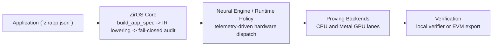

# ZirOS: The Zero-Knowledge Operating System

Automating Truth. Prove anything. Trust nothing. Run everywhere.

## The Agentic Thesis: Formal Verification as the API

ZirOS is built for autonomous operators. A Claude, Codex, Manus, or in-house
agent should not need a PhD in pairing cryptography to ship a safe proof
application. It should need three things:

1. deterministic commands,
2. structured JSON outputs,
3. a fail-closed audit surface that explains exactly what went wrong and how to
   fix it.

That is the core thesis of ZirOS: formal verification is the interface. An
agent does not need to be trusted because the math is the authority. The Lean
and Coq proof surfaces, the audited IR lowering pipeline, and the fail-closed
runtime checks are designed so an insecure circuit is rejected before it
becomes a build artifact.

In practice that means an agent can scaffold an application, run the audit,
read a machine-readable failure, apply the correction, and keep going. If it
forgets nonlinear anchoring, the audit stops it. If it asks for an unsupported
strict lane, the runtime stops it. If it drifts from the attested GPU path, the
verified Metal boundary stops it.

Concrete example: a scientist asks their agent to prove that clinical-trial
records satisfy an FDA threshold without exposing patient data. The agent
scaffolds the app, hits an audit failure for underconstrained signals, reads the
plain-English remediation, routes the private values through a Poseidon anchor,
passes the audit, and deploys the Solidity verifier. On an Apple Silicon
MacBook, that is intended to be a normal workflow, not an expert-only stunt.

## What Is ZirOS?

ZirOS is not a library and it is not just a framework. It is the operating
system layer that sits between application logic and raw proving machinery.

Applications describe intent in `zirapp.json` or through `ProgramBuilder`.
ZirOS then owns the rest of the path:

- IR lowering and normalization
- fail-closed audit and underconstraint detection
- witness generation and witness safety checks
- backend selection and trust-lane routing
- CPU vs GPU scheduling
- Metal pipeline dispatch
- telemetry and Neural Engine policy inputs
- swarm coordination and peer reputation
- verifier export and deployment packaging

That makes the repository opinionated in the right place. Developers and agents
author the statement they want proven. ZirOS handles the cryptographic
plumbing, the hardware policy, the safety rails, and the release artifacts.

## The Apple Silicon Rationale

ZirOS targets Apple Silicon as its primary execution environment because the
hardware matches zero-knowledge proving workloads unusually well.

- Unified Memory Architecture (UMA) removes the usual CPU↔GPU copy boundary and
  enables zero-copy data movement across proving stages.
- M-series Max chips reach memory bandwidth figures up to roughly 800 GB/s,
  which matters for memory-bound kernels such as MSM and NTT.
- The repo ships Metal acceleration and keeps a prewarmed pipeline inventory on
  the certified host lane. The current Apple Silicon path includes 14 prewarmed
  Metal GPU pipelines and AOT-compiled shaders.
- Metal avoids the traditional PCIe-bound discrete GPU latency profile. For the
  proving path ZirOS cares about, that lowers dispatch overhead and keeps the
  scheduler policy simple and deterministic.

Apple Silicon is therefore not just a convenient supported target. It is the
machine ZirOS is shaped around.

## System Architecture



The control flow above is backed by explicit crate boundaries:

- `zkf-lib` and `zkf-cli` expose the application and operator surfaces.
- `zkf-core` defines IR, witness generation, field arithmetic, and audits.
- `zkf-backends` owns compile/prove/verify per backend.
- `zkf-runtime` owns UMPG planning, scheduling, telemetry, and policy.
- `zkf-metal` owns the Apple GPU path and attested dispatch surfaces.
- `zkf-distributed` and `zkf-runtime` own cluster/swarm coordination.

## Fail-Closed Audit

The audit system runs before proving and is designed to reject ambiguity, not to
comment on it politely.

It computes linear rank and matrix nullity over the circuit surface, then asks a
stronger question: does every private signal participate in a nonlinear
relation that actually constrains it? If the answer is no, ZirOS fails closed.

That is how ZirOS blocks the classic underconstrained-signal failure mode. A
signal that only appears in addition, subtraction, or equality constraints may
still be movable by a malicious prover. ZirOS refuses to compile that program
until the signal is anchored through a nonlinear operation such as a Poseidon
hash, a boolean constraint, or a multiplication gate.

See [`docs/NONLINEAR_ANCHORING.md`](docs/NONLINEAR_ANCHORING.md).

## The Swarm And Neural Engine

### Swarm

The swarm surface coordinates distributed proving and defensive runtime policy.
It tracks peer reputation, persists a reputation log, supports anomaly
detection, and exposes operational controls through `zkf-cli swarm ...`.

Swarm logic is allowed to change scheduling and rejection posture. It is not
allowed to change circuit semantics, witness semantics, or verifier truth.

### Neural Engine

The Neural Engine path is the control plane, not the proof plane. It consumes
telemetry and runtime context to recommend the best hardware route for a job:
CPU, Metal GPU, or a stricter certified lane. Proof validity never depends on
the model. Dispatch policy may depend on the model. Proof truth does not.

## SSD Guardian: iCloud-Integrated Storage Lifecycle

ZirOS is the first zero-knowledge framework to ship an embedded storage
lifecycle subsystem. The SSD Guardian classifies every artifact the proving
pipeline produces, archives irreplaceable outputs to iCloud, purges ephemeral
waste, and enforces witness deletion as a security operation — automatically,
in the background, tuned to the specific Mac it is running on.

### Why This Matters

Zero-knowledge proving is storage-hostile. A single 100-step reentry thermal
circuit generates 197 MB of artifacts: a 159 MB compiled constraint system,
a 26 MB witness file containing 221,779 private field elements, 12 MB of
program representations, plus traces, verifiers, and reports. The Rust
workspace build cache adds another 41 GB of incremental compilation objects.
Run twenty programs through testing, calibration, and production proving, and
you consume 200–300 GB on a machine with a 1 TB SSD.

No other ZK framework manages this. Circom does not. snarkjs does not. Halo2
does not. Arkworks does not. They assume infinite disk or manual cleanup.
ZirOS assumes you are on a laptop and you have better things to do.

### The Three-Class File System

Every file ZirOS produces is classified into one of four retention classes:

**Local Critical** — never leaves the machine, never deleted:
- `~/.zkf/swarm/**` — live defense state (Queen, Sentinel, Warrior)
- `~/.zkf/keystore/**` — Ed25519 + ML-DSA-44 cryptographic keys
- `~/.zkf/tuning/**` — adaptive Metal GPU dispatch thresholds
- `~/.zkf/security/**` — quarantine markers and security event logs

**Archivable** — moved to iCloud, organized by category and run name:
- `*.proof.json` — Groth16/STARK proof artifacts (128 bytes–6 KB)
- `*.execution_trace.json` — UMPG stage timing, GPU attribution, security verdict
- `*Verifier.sol` — Solidity on-chain verification contracts
- `*.report.md` — mission assurance reports
- `~/.zkf/telemetry/**` — Neural Engine training data (2,000+ records)

**Ephemeral** — deleted immediately, can be regenerated:
- `target-local/debug/**` — 41 GB Rust incremental build cache
- `*.compiled.json` — 80–159 MB compiled constraint systems
- `*.witness.*.json` — witness files (security-critical deletion)
- `*.program.json` — circuit IR representations

**Operational** — left untouched:
- `target-local/release/**` — the binary you run
- `~/.zkf/models/*.mlpackage` — CoreML model packages

### Witness Purging Is A Security Operation

This is the most important thing the SSD Guardian does. A witness file
contains every private input to a zero-knowledge circuit: the classified
trajectory, the proprietary aerodynamic coefficients, the guidance policy,
the bank-angle schedule, the vehicle mass, the atmospheric density profile.
If the purpose of a ZK proof is to hide those values, leaving the witness on
disk after proving is a direct contradiction of the security model.

The guardian's `purge_witness_after_prove` is enabled by default. The moment
a proof is generated and verified, the witness is deleted — before the output
bundle is written. There is no window where the witness sits on disk
unprotected after a successful proof.

Failed witnesses are also deleted. A failed computation may contain partial
values that reveal structural information about private inputs without the
corresponding proof that would justify their existence.

The only way to retain witnesses is `ZKF_STORAGE_PURGE_WITNESS=0`, a
development-only bypass treated identically to
`ZKF_ALLOW_DEV_DETERMINISTIC_GROTH16`.

### iCloud Integration

The archive tier uses `~/Library/Mobile Documents/com~apple~CloudDocs/`
because it is the only cloud storage natively integrated into macOS:

- **Automatic local eviction**: when SSD space is tight, macOS replaces
  local copies with lightweight placeholders that occupy zero bytes until
  opened.
- **Zero configuration**: every Mac with an Apple ID has iCloud Drive.
  No daemon, no credentials, no API keys.
- **End-to-end encryption**: with Advanced Data Protection enabled,
  encryption keys are held only on your devices, not by Apple.

The archive is structured for browsability:

```
~/Library/Mobile Documents/com~apple~CloudDocs/
└── ZirOS_Archive/
    ├── proofs/{run_name}/         128-byte Groth16 proofs
    ├── traces/{run_name}/         UMPG execution telemetry
    ├── verifiers/{run_name}/      Solidity contracts
    ├── reports/{run_name}/        Mission assurance reports
    ├── audits/{run_name}/         Circuit security audits
    └── telemetry/{date}/          Neural Engine training data
```

Every run gets its own timestamped directory. You can browse the archive from
any Apple device. At 128 bytes per proof, 4 TB of iCloud storage holds 31
billion proofs.

### What Never Goes To iCloud

The guardian enforces a strict data-class boundary. Cryptographic keys,
swarm defense state, security quarantine markers, and adaptive tuning state
never leave the local machine — not even to iCloud. If iCloud were
compromised, the attacker would find proofs (public by design), execution
traces (operational), and telemetry (anonymizable) — never keys, never
witnesses, never defense state.

### Device-Adaptive Profiles

The guardian auto-detects SSD capacity and selects thresholds:

| Profile | SSD | Warn | Critical | Monitor | Debug Cache |
|---------|-----|------|----------|---------|-------------|
| Constrained | ≤ 300 GB | 30 GB | 15 GB | 30 min | Purge every build |
| Standard | 301–600 GB | 50 GB | 25 GB | 1 hour | Purge after tests |
| Comfortable | 601 GB–1.2 TB | 100 GB | 50 GB | 1 hour | Purge weekly |
| Generous | > 1.2 TB | 200 GB | 100 GB | Daily | Purge monthly |

A 256 GB MacBook Air gets Constrained: aggressive cleanup, 30-minute
monitoring, immediate proof archival. A Mac Studio with 8 TB gets Generous:
relaxed thresholds, daily monitoring, build caches kept for fast incremental
compilation.

### The Background Agent

```bash
zkf storage install
```

This installs a macOS launchd agent (`com.ziros.storage-guardian`) that runs
`zkf storage sweep --auto` every hour. It runs at low I/O priority and will
never compete with proving workloads. If free space is healthy, it logs a
one-line check and exits. If free space drops below the warning threshold, it
archives to iCloud. Below critical, it runs a full sweep.

### Measured Results

From a 100-step reentry thermal proving run on M4 Max (48 GB, 1 TB SSD):

| Metric | Value |
|--------|-------|
| Artifacts created | 197 MB (17 files) |
| Archived to iCloud | 130 KB (9 files — proofs, traces, verifiers, reports) |
| Purged from disk | 191 MB + 12.8 GB build cache |
| Remaining on disk | 1.3 KB (README.md) |
| Witness deleted | 26 MB (221,779 private field elements) |
| Free space recovered | 44 GB across two test sweeps |
| iCloud archive total | 2,153 files, 25 MB |

### Commands

```bash
zkf storage status          # Disk health, build cache, iCloud archive, recoverable estimate
zkf storage doctor --json   # SSD wear, temperature, SMART diagnostics
zkf storage sweep           # Archive to iCloud + purge ephemeral artifacts
zkf storage sweep --auto    # Threshold-aware: only acts when disk is low
zkf storage archive         # Archive only (no purge)
zkf storage purge           # Purge only (no archive)
zkf storage restore <path>  # Force-download a file from iCloud
zkf storage install         # Install hourly launchd background agent
```

## Supported Backends And Frontends

### Primary Backends

| Backend ID | Friendly Name | Field(s) | Trusted Setup | Primary Use Case |
| --- | --- | --- | --- | --- |
| `arkworks-groth16` | Arkworks Groth16 | BN254 | Yes | Smallest proofs, cheapest EVM verification, direct Solidity export |
| `plonky3` | Plonky3 STARK | Goldilocks, BabyBear, Mersenne31 | No | Transparent default path for first proofs and Metal-accelerated STARK proving |
| `halo2` | Halo2 IPA | Pasta Fp | No | Transparent Plonkish proving with local verification and Pasta-field circuits |
| `halo2-bls12-381` | Halo2 KZG | BLS12-381 | Yes | BLS12-381 KZG lane where trusted setup is acceptable |
| `nova` | Nova | BN254-facing recursive shell | No ceremony in the ZirOS recursive shell | Incremental proving and recursive folding workflows |
| `hypernova` | HyperNova | BN254-facing recursive shell | No ceremony in the ZirOS recursive shell | Higher-throughput multifolding workflows |
| `midnight-compact` | Midnight Compact | Pasta Fp, Pasta Fq | External / delegated | Compact proof-server workflows; live support matrix currently marks this lane unconfigured |

The live support matrix for this checkout is
[`support-matrix.json`](support-matrix.json).

### Frontends

- Noir
- Circom
- Cairo
- Compact
- Halo2-Rust
- Plonky3-AIR
- zkVM

## Quick Start

Prebuilt install:

```bash
curl -sSf https://zkf.dev/install.sh | sh
export PATH="$HOME/.zkf/bin:$PATH"
ziros doctor
```

Source build from a fresh clone:

```bash
git clone git@github.com:anubisquantumcipher/ziros.git
cd ziros
./install.sh
zkf-cli app init --template range-proof --name quickstart --out /tmp/quickstart
cargo test --manifest-path /tmp/quickstart/Cargo.toml --quiet
cargo run --manifest-path /tmp/quickstart/Cargo.toml --quiet
```

Direct CLI path from `zirapp.json` to a verified proof:

```bash
./target-local/release/zkf-cli compile --spec /tmp/quickstart/zirapp.json --backend plonky3 --out /tmp/quickstart/compiled.json
./target-local/release/zkf-cli prove --program /tmp/quickstart/zirapp.json --inputs /tmp/quickstart/inputs.compliant.json --out /tmp/quickstart/proof.json
./target-local/release/zkf-cli verify --program /tmp/quickstart/zirapp.json --artifact /tmp/quickstart/proof.json --backend plonky3
```

For the full EPA walkthrough, see
[`docs/GETTING_STARTED.md`](docs/GETTING_STARTED.md).
