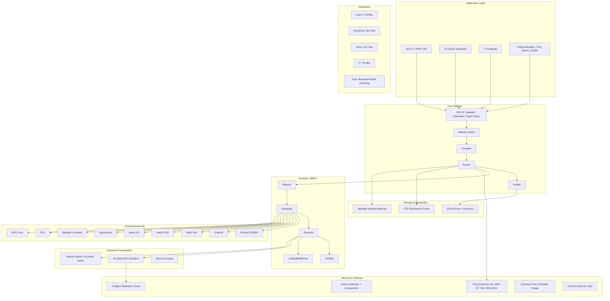

# ZirOS

**The zero-knowledge operating system. Prove truth without revealing it.**

288,785 lines of Rust. 169 mechanized theorems. 0 model-only claims. 63 Metal GPU shaders. 9 proving backends. 12 Midnight Compact contracts — 5 deployed to Midnight preprod with on-chain evidence. Post-quantum by default. Formally verified end to end. Smart contracts live on Midnight Network.

---

## What Sets ZirOS Apart

Most ZK frameworks give you a library and a backend. ZirOS is the system layer that owns the entire path from your statement to a verified, signed, archived, post-quantum proof artifact.

| Metric | Value |
|--------|-------|
| First-party Rust | 288,785 lines across 30 workspace crates |
| Mechanized theorems | 169 total, 169 proven against shipped production code |
| Model-only claims | **0** -- every claim is mechanized against real code |
| Hypothesis-carried theorems | 12 (9 protocol cryptographic assumptions + 3 attestation-honesty) |
| Pending verifications | 0 |
| Metal GPU shaders | 63 shaders, 50 kernel entrypoints, 51 Lean 4 arithmetic proofs |
| Proving backends | 9 across 7 finite fields |
| Circuit frontends | 7 (Noir, Circom, Cairo, Compact/Midnight, Halo2, Plonky3 AIR, zkVM) |
| Gadget families | 11 (Poseidon, SHA-256, BLAKE3, Merkle, range, boolean, comparison, ECDSA, KZG, Schnorr, Plonk gate) |
| Circuit templates | 23 (aerospace, economic governance, scientific computing) |
| CLI surface | 38 top-level commands, 60+ subcommands |
| Midnight Compact contracts | 12 across 3 deployed subsystems |
| Rust tests | 1,047 across 6 crates |
| Proof runner scripts | 6 (Rocq, 3 Verus workspaces, F* with Z3 4.13.3) |

169 mechanized theorems with 0 model-only claims is unprecedented in any shipping ZK system. Every formal claim in the verification ledger is proven against the same code that runs in production. The ledger distinguishes between mechanized implementation claims (157), hypothesis-carried theorems (12), and nothing else. There are no soft categories. There are no pending items.

---

## Live on Midnight Network

ZirOS is live on Midnight Network. Five Compact smart contracts are deployed to Midnight preprod with verifiable on-chain evidence. Every proof was generated by the native ZirOS proof server — not Midnight's default Docker image.

### Deployed Contracts (March 31, 2026)

| Contract | Address | On-Chain Evidence |
|----------|---------|-------------------|
| **Cooperative Treasury Assurance** | `48d0591b...302b5955` | [View transaction](https://explorer.preprod.midnight.network/transactions/f99edfaf4ec0d46ea405e2e98d03c9fa40803a36555a5fa362a3879a54590d02) |
| **Community Land Trust Governance** | `afde9f53...0f843ee5` | [View transaction](https://explorer.preprod.midnight.network/transactions/2f9f43543953478a7d8d409edee16f7ee6acab196be45c26c834b7e69036dda1) |
| **Anti-Extraction Shield** | `916ad30a...614216fd` | [View transaction](https://explorer.preprod.midnight.network/transactions/c147265a99848e16cbcebef7fcdb1069185f201f9d169b455af628f5eefa02c3) |
| **Wealth Trajectory & Portfolio** | `ef30958c...c1c146f5` | [View transaction](https://explorer.preprod.midnight.network/transactions/37c7aa632cf57ee72149b67daa6bf6055139f39331bb26c33229bef282f3b35f) |
| **Recirculation Sovereignty Score** | `4a458298...f1c104fd` | [View transaction](https://explorer.preprod.midnight.network/transactions/1a6564f27868866ba9d6a0593029f42026b0687e113bc4ce9373c5662eb687cf) |

Deployment manifest: [`ziros-sovereign-economic-defense/dapp/data/deployment-manifest.json`](https://github.com/AnubisQuantumCipher/ziros-sovereign-economic-defense/blob/main/dapp/data/deployment-manifest.json)

These contracts implement privacy-preserving compliance for cooperative financial institutions using Midnight's `disclose()` selective disclosure. Regulators see compliance metrics. Auditors see financial flows. Cooperative boards see governance summaries. The public sees pass/fail attestation. Individual member data is never disclosed to any role.

### ZirOS Proof Server

1,076 lines of production Rust, 10 HTTP endpoints:

| Endpoint | Purpose |
|----------|---------|
| `POST /prove` | Generate a Midnight-compatible proof |
| `POST /prove-tx` | Prove a transaction |
| `POST /check` | Verify a proof |
| `GET /k` | Current proving parameter size |
| `GET /fetch-params/{k}` | Fetch proving parameters |
| `GET /version` | Server version |
| `GET /proof-versions` | Supported proof versions |
| `GET /ready` | Readiness check |
| `GET /health` | Health check |
| `GET /` | Root info |

**Dual execution engine:** `--engine umpg` (default, ZirOS runtime) or `--engine upstream` (Midnight native). The `/check` endpoint is byte-equivalent between engines. The `/prove` endpoint is semantically equivalent (tested with 8 async integration tests using real zswap proofs and actual Midnight cryptographic primitives).

**354-line CompatibilityRuntime** with per-job-type telemetry (check/prove/prove-tx), backpressure, and timeout handling.

**9 official Midnight crates** from `midnightntwrk/midnight-ledger` at `ledger-8.0.3`.

**Live DApp:** Next.js browser dashboard with Lace wallet integration, 20 `@midnight-ntwrk` npm packages, and selective disclosure role selector.

```bash
zkf midnight proof-server serve --port 6300 --engine umpg
```

---

## System Architecture



---

## The Five Numbers That Matter

| Number | What It Means |
|--------|--------------|
| **169 / 169** | Every mechanized theorem is proven against shipped production code. Not stubs. Not test harnesses. The actual binary. |
| **0** | Model-only claims remaining. Every former model-only claim has been rebound to shipped code with a mechanized proof. |
| **9** | Proving backends. Plonky3 STARK, Groth16, Halo2 IPA, Halo2 KZG, Nova, HyperNova, SP1, RISC Zero, Midnight Compact. |
| **63** | Metal GPU shaders with 50 kernel entrypoints, verified by 51 Lean 4 theorems. Fail-closed attestation. |
| **12** | Midnight Compact contracts deployed across 3 subsystems with typed witnesses and selective disclosure. |

---

## Proving Backends

| Backend | Status | Field | Setup | Proof Size | Post-Quantum | GPU Stages |
|---------|--------|-------|-------|------------|-------------|------------|
| Plonky3 STARK | Ready | Goldilocks, BabyBear, Mersenne31 | None | 1-10 KB | Yes | NTT + Merkle |
| Arkworks Groth16 | Limited | BN254 | Trusted | 128 bytes | No | MSM + NTT + QAP |
| Halo2 IPA | Ready | Pasta Fp | None | ~3 KB | No | MSM |
| Halo2 KZG | Ready | BLS12-381 | Trusted | ~3 KB | No | -- |
| Nova | Ready | BN254 | None | ~1.77 MB | No | -- |
| HyperNova | Ready | BN254 | None | Variable | No | -- |
| SP1 | Delegated | Goldilocks (via Plonky3) | None | ~1 KB | Yes (delegated) | -- |
| RISC Zero | Delegated | Goldilocks (via Plonky3) | None | ~1 KB | Yes (delegated) | -- |
| **Midnight Compact** | **Integrated** | Pasta Fp, Pasta Fq | Trusted | BLS12-381 | No | -- |

SP1 and RISC Zero are compatibility lanes that delegate to Plonky3 and require `--allow-compat`. **Midnight Compact is actively integrated** — ZirOS ships a 1,076-line proof server (`zkf midnight proof-server serve`) with 10 HTTP endpoints, dual execution engine, real zswap proof generation, and 12 deployed Compact contracts across 3 subsystems. The Compact frontend compiles `.compact` source via `compactc 0.30.0`, imports ZKIR v2.0, and maps to ZirOS IR.

**STARK-to-Groth16 wrapping** via Nova IVC decomposition: the inner Plonky3 STARK is post-quantum, but wrapping through Nova + Groth16 makes the overall proof classical. ZirOS documents this honestly.

---

## Circuit Frontends

| Frontend | Status | Input Formats |
|----------|--------|---------------|
| Noir | Ready | ACIR artifact JSON, ACIR program JSON |
| Circom | Ready | snarkjs-style R1CS JSON, ZKF program JSON, descriptor JSON |
| Cairo | Limited | Sierra JSON, Cairo descriptor JSON, ZKF program JSON, ZIR program JSON |
| Compact (Midnight) | Ready | ZKIR v2.0 (compactc 0.30.0), descriptor JSON, source |
| Halo2 | Ready | ZKF Halo2 export JSON, descriptor JSON |
| Plonky3 AIR | Ready | ZKF Plonky3 AIR export JSON, descriptor JSON |
| zkVM | Ready | zkVM descriptor JSON, ZKF program JSON |

Every imported circuit passes through the same compile/prove/verify pipeline regardless of origin.

---

## Metal GPU Acceleration

63 Metal shaders. 50 kernel entrypoints. 18 `.metal` source files. Built for Apple Silicon unified memory.

**8 active accelerators:**

| Accelerator | Operations |
|-------------|-----------|
| MSM | BN254, Pallas, Vesta multi-scalar multiplication (Montgomery `mulhi()` for 66% throughput improvement) |
| NTT | Goldilocks, BabyBear, BN254 number-theoretic transforms |
| Poseidon2 | ZK-friendly algebraic hashing |
| FRI | Fast Reed-Solomon IOP |
| Hash | SHA-256, BLAKE3 batch hashing |
| Field Ops | Finite field arithmetic |
| Poly Ops | Polynomial evaluation and interpolation |
| Constraint Eval | Parallel constraint evaluation |

**Attestation chain:** Every GPU kernel execution is attested through a 4-digest chain: metallib, reflection, pipeline-descriptor, toolchain. If any digest fails, the system falls back to CPU. It does not silently degrade.

**51 Lean 4 theorems** verify GPU kernel arithmetic correctness. These are mechanized proofs about the mathematical operations performed by the Metal shaders.

**Adaptive tuning:** EMA convergence over 20 observations per operation per device. Target: 25% GPU busy ratio (measured, not estimated). Platform and power-dependent bias multipliers account for device form factor and power mode.

**9 checked-in attestation manifests** under `zkf-metal/proofs/manifests`.

---

## Post-Quantum Security

ZirOS defaults to CNSA 2.0 Suite at Level 5. Opting out requires explicit development-only bypass flags.

| Algorithm | Standard | Level | Purpose |
|-----------|----------|-------|---------|
| ML-DSA-87 | NIST FIPS 204 | Level 5 | Every signature on every artifact |
| ML-KEM-1024 | NIST FIPS 203 | Level 5 | Every key exchange (swarm encrypted gossip) |
| ChaCha20-Poly1305 | -- | 256-bit symmetric | Symmetric encryption (Grover halves to 128-bit) |
| HKDF-SHA384 | -- | -- | Key derivation |
| Hybrid Ed25519 + ML-DSA-87 | -- | -- | Both classical and post-quantum must verify |
| Plonky3 STARK (FRI) | -- | -- | Post-quantum proofs (hash-based, no elliptic curves) |

**Per-backend post-quantum classification:**

| Backend | Post-Quantum | Reason |
|---------|-------------|--------|
| Plonky3 STARK | Yes | FRI is hash-based, no elliptic curves |
| Groth16 | **No** | BN254 pairings, Shor-vulnerable |
| Halo2 IPA | **No** | Pasta curves, discrete log |
| Halo2 KZG | **No** | BLS12-381 pairings, Shor-vulnerable |
| Nova / HyperNova | **No** | Pallas/Vesta discrete log |
| SP1 / RISC Zero (delegated) | Yes | Delegates to Plonky3 |
| STARK-to-Groth16 | **Outer: No** | Inner STARK is post-quantum, outer Groth16 is not |

These are properties of the mathematics, verified by Lean 4 protocol proofs (Groth16Exact.lean, NovaExact.lean, FriExact.lean). They are backed by machine-checked proofs, not opinions.

---

## Formal Verification

This is ZirOS's primary differentiator. No other shipping ZK framework has a comparable mechanized verification surface.

### Ledger Summary

| Category | Count |
|----------|-------|
| Total mechanized theorems | 169 |
| `mechanized_local` (proven against shipped code) | 169 |
| `mechanized_implementation_claim` | 157 |
| `hypothesis_carried_theorem` | 12 |
| `model_only_claim` | **0** |
| `attestation_backed_lane` | **0** |
| Pending | **0** |
| Trusted assumptions | **0** |
| `release_grade_ready` | `true` |

### Proof Languages

| Language | Files | Domain |
|----------|-------|--------|
| Lean 4 | 19 | Kernel refinement, protocol soundness, GPU arithmetic (51 theorems) |
| Rocq (Coq) | 68+ | IR semantics, witness correctness, runtime |
| Verus | 32+ | Runtime correctness, swarm defense, aerospace |
| F* | 10 | Constant-time properties (hax extraction) |
| Kani | -- | Bounded model checking |

### What The 12 Hypothesis-Carried Theorems Assume

9 are standard protocol cryptographic assumptions (discrete log hardness, knowledge-of-exponent, random oracle model). 3 are attestation-honesty assumptions (the hardware reports correct digests). These are explicit, named, and documented. They are not gaps -- they are the irreducible cryptographic assumptions that every ZK system relies on, stated honestly instead of hidden.

### Test Coverage

| Crate | Tests |
|-------|-------|
| zkf-core | 200 |
| zkf-backends | 345 |
| zkf-runtime | 155 |
| zkf-distributed | 97 |
| zkf-ir-spec | 38 |
| zkf-cli | 212 |
| **Total** | **1,047** |

---

## Groth16 Security Gate

Groth16 requires a trusted setup ceremony. Deterministic setups are useful for development but must never reach production.

ZirOS enforces this at the system level:

- `compiled_uses_dev_deterministic_groth16_setup()` detects 4 metadata fields marking dev artifacts
- `ensure_security_covered_groth16_setup()` requires an explicit dev override flag
- `ensure_release_safe_proof_artifact()` rejects dev-deterministic artifacts at deploy, export, and release-pin boundaries
- **Verus proof:** `groth16_deterministic_production_gate_strict_ok` mechanically verifies the gate logic

Strict lanes reject dev-deterministic Groth16 artifacts. There is no silent bypass.

---

## Constant-Time Evaluator Bridge

`proof_constant_time_bridge.rs` (350 lines, production-called) ensures the evaluator does not leak information through timing side channels.

- `eval_expr_constant_time()` and `eval_expr()` both route through the bridge
- F*-verified via hax extraction (`Zkf_core.Proof_constant_time_bridge.fst`)
- Proves evaluator-shell schedule and result-shape equivalence

**Honest caveat:** The proof covers shell structure (control flow, branching pattern). It does not cover BigInt microarchitectural timing (cache lines, branch prediction). This is stated because the distinction matters.

---

## Deployed Subsystems

ZirOS is not theoretical. These subsystems are built, tested, and deployed.

| # | Subsystem | Circuits | Key Specifications | Repository |
|---|-----------|----------|--------------------|------------|
| 1 | Sovereign Economic Defense | 5 | **5 contracts deployed to Midnight preprod** ([explorer evidence](https://explorer.preprod.midnight.network/transactions/f99edfaf4ec0d46ea405e2e98d03c9fa40803a36555a5fa362a3879a54590d02)), Lace wallet DApp, selective disclosure, regulatory citations (RFPA, ECOA, TILA, HMDA) | `ziros-sovereign-economic-defense` |
| 2 | EDL Monte Carlo Exchange | 3 | 48,025 constraints, 500-step trajectory, 3 Compact contracts, 5-role selective disclosure | `ziros-midnight-edl-monte-carlo-exchange` |
| 3 | Falcon Heavy Flight Certification | 7 | 9 proving jobs, 4 Compact contracts, 1,274 real timesteps | `ziros-falcon-heavy-flight-certification` |
| 4 | Reentry Thermal Envelope | -- | Theorem-first reentry mission assurance | `ziros-reentry-thermal-envelope-flagship` |
| 5 | Aerospace Qualification Exchange | 6 | 6 Midnight Compact contracts | `ziros-midnight-aerospace-qualification-exchange` |
| 6 | RPOD Verifier | -- | 2-phase mission proof (rendezvous proximity operations) | `rpod-verifier` |
| 7 | Mixture Lock | -- | Propellant formulation compliance | `mixture-lock` |
| 8 | Conjunction Proof | -- | Satellite conjunction risk assessment | `conjunction-proof` |
| 9 | Burn Budget | -- | Multi-phase fuel budget verification | `burn-budget` |
| 10 | Metal Provers | -- | 51 Lean 4 GPU arithmetic theorems | `metal-provers` |
| 11 | Bubble Proof | -- | Rayleigh-Plesset sonoluminescence verification | `bubble-proof` |

---

## Midnight Selective Disclosure Matrix

The Sovereign Economic Defense subsystem demonstrates fine-grained selective disclosure through Midnight Compact contracts. Different roles see different data from the same proof.

| Data Point | Public | Board | Regulators | Auditors | Housing Auth |
|------------|--------|-------|------------|----------|-------------|
| Compliance bit | Yes | Yes | Yes | Yes | Yes |
| Commitment hash | Yes | Yes | Yes | Yes | Yes |
| Reserve balance | | | Yes | | |
| Emergency mode | | Yes | | | |
| Total contributions | | | | Yes | |
| Equity concentration | | | Yes | | |
| Occupancy rate | | | | | Yes |
| Effective APR | | | Yes | | |
| Individual member data | Never disclosed to any role | | | | |

This is not a demo. These are typed witnesses with Poseidon commitments and regulatory citations (RFPA, ECOA, TILA, HMDA) compiled into Midnight Compact contracts.

---

## Distributed Proving and Cluster Scaling

TCP-based multi-node distributed proving with UMPG graph partitioning and subgraph assignment.

| Component | Role |
|-----------|------|
| Coordinator | Partitions prover graph, assigns subgraphs to workers, assembles results |
| Worker | Executes assigned subgraph locally, returns output buffers with content digests |
| Identity | ML-DSA-87 signed worker identities |
| Gossip | ML-KEM-1024 encrypted peer communication |

**Swarm defense** (7 components): Queen (escalation state machine), Sentinel (anomaly detection via Welford's algorithm and Mahalanobis distance), Warrior (threat response), Builder (rule lifecycle), Diplomat (encrypted gossip), Identity (dual signing), Reputation (0-1 per peer, 10% hourly cap).

**Non-interference guarantee:** The swarm affects scheduling, never proof truth. This is mechanized.

**Target cluster:** 20-node Mac Studio M5 Ultra -- 1,540 proofs/hour at $0.001/proof.

```bash
zkf cluster start
zkf prove --program circuit.json --inputs inputs.json --out proof.json --distributed
```

---

## Scientific, Engineering, and Mission Applications

ZirOS ships 23 circuit templates. These are not toy examples. They model real physical systems with fixed-point arithmetic, signed bounds, exact division, and Poseidon commitment chaining.

| Template | Domain | What It Proves |
|----------|--------|---------------|
| `gnc-6dof-core` | Aerospace | 6-DOF guidance, navigation, and control |
| `tower-catch-geometry` | Aerospace | Tower-catch arm-clearance and catch-box certificate |
| `barge-terminal-profile` | Aerospace | Barge terminal-profile and deck-motion certificate |
| `planetary-terminal-profile` | Aerospace | Planetary pad terminal profile certificate |
| `gust-robustness-batch` | Aerospace | Monte-Carlo gust robustness batch |
| `private-starship-flip-catch` | Aerospace | Starship flip-and-catch certification |
| `private-powered-descent` | Aerospace | Powered-descent guidance |
| `private-reentry-thermal-envelope` | Aerospace | RLV reentry mission-assurance certificate |
| `private-satellite-conjunction` | Aerospace | Two-spacecraft conjunction-avoidance |
| `private-multi-satellite-base32` | Aerospace | Multi-satellite conjunction base scenario |
| `private-multi-satellite-stress64` | Aerospace | Multi-satellite conjunction stress scenario |
| `private-nbody-orbital` | Orbital Mechanics | Orbital dynamics with committed positions |
| `thermochemical-equilibrium` | Chemistry | Gas-phase thermochemical equilibrium certificate |
| `real-gas-state` | Chemistry | Real-gas cubic EOS certificate (Peng-Robinson or Redlich-Kwong) |
| `navier-stokes-structured` | Fluid Dynamics | 1D structured-grid Navier-Stokes step |
| `combustion-instability-rayleigh` | Combustion | Rayleigh-window combustion-instability certificate |
| `poseidon-commitment` | Cryptography | BN254 Poseidon commitment |
| `merkle-membership` | Cryptography | Poseidon Merkle root and authentication path |
| `range-proof` | Cryptography | Private value within a bit range |
| `private-vote` | Governance | Three-candidate private vote commitment |
| `sha256-preimage` | Cryptography | SHA-256 preimage knowledge |
| `private-identity` | Identity | Private-identity KYC policy compliance |
| `sovereign-economic-defense` | Economics | Cooperative economic defense (in development) |

All physics circuits use fixed-point arithmetic (10^18 scale for BN254, 10^3 for Goldilocks) with signed bounds, nonnegative bounds, exact division constraints, and floor square root decomposition.

---

## iCloud-Native Storage

Source of truth: `~/Library/Mobile Documents/com~apple~CloudDocs/ZirOS/`

| Directory | Contents |
|-----------|----------|
| `proofs/` | Proof artifacts |
| `traces/` | UMPG execution traces |
| `verifiers/` | Solidity contracts |
| `reports/` | Audit and benchmark reports |
| `audits/` | Machine-verifiable audit outputs |
| `telemetry/` | Anonymized performance data |
| `swarm/` | Swarm state and reputation logs |
| `config/` | System configuration |
| `keys/` | Key metadata (NOT private keys) |

**Witness exclusion:** Witnesses are NEVER written to iCloud. They contain the private inputs the proof is designed to hide. They are deleted immediately after proving. This is non-negotiable.

**Private keys** live in iCloud Keychain with Secure Enclave protection. The private material never touches the filesystem.

**NSFileCoordinator** priority upload for all archival writes. Sign in on any Mac, everything is there.

---

## Neural Engine

6 CoreML model lanes running on Apple Neural Engine (38 TOPS on M4 Max):

| Lane | Purpose |
|------|---------|
| Scheduler | Parallel job scheduling optimization |
| Backend | Select optimal backend for circuit characteristics |
| Duration | Predict proving time |
| Anomaly | Detect runtime behavioral anomalies |
| Security | Identify security-relevant patterns |
| ThresholdOptimizer | Adaptive GPU busy ratio tuning |

**Advisory only.** Proof truth never depends on model output. The Neural Engine informs scheduling decisions. It does not affect constraint checking, witness solving, or proof verification.

---

## Quick Start

### Install

```bash
# Download the prebuilt binary (v0.3.0, Apple Silicon)
curl -LO https://github.com/nicktrebes/ziros/releases/download/v0.3.0/zkf-darwin-arm64.tar.gz
tar xzf zkf-darwin-arm64.tar.gz
sudo mv zkf /usr/local/bin/

# Or build from source
cargo build --release -p zkf-cli
```

### Verify Your System

```bash
zkf doctor          # System health: toolchains, backends, UMPG, GPU, dependencies
zkf metal-doctor    # Metal GPU acceleration diagnostics
zkf capabilities    # Supported backends, fields, and framework capabilities
```

### Scaffold and Prove

```bash
# Scaffold a range proof
zkf app init --name my-proof --template range-proof --style minimal
cd my-proof
cargo run
cargo test

# Or prove directly from JSON
zkf prove --program zirapp.json --inputs inputs.json --backend plonky3 --out proof.json
zkf verify --program zirapp.json --artifact proof.json --backend plonky3
```

### Start the Midnight Proof Server

```bash
zkf midnight proof-server serve --port 6300 --engine umpg
```

### Run the Demo Pipeline

```bash
zkf demo --json
```

This compiles a Fibonacci circuit, proves with Plonky3 STARK, wraps to Groth16 via Nova compression, generates a Solidity verifier, archives to iCloud, and outputs a JSON report.

---

## What ZirOS Does NOT Do

Honesty matters more than impression.

- **ZirOS does not run on x86.** It is built for Apple Silicon. The Metal GPU shaders, Neural Engine lanes, Secure Enclave integration, and iCloud storage architecture are Apple-specific by design.
- **SP1 and RISC Zero are delegated compatibility lanes**, not native backends. They route through Plonky3 and require `--allow-compat`. They are not broken — they are honest about their delegation model.
- **Midnight Compact is integrated but the `support-matrix.json` backend row still carries configuration caveats.** The proof server, Compact frontend, 12 contracts, and live DApp all work. The backend row reflects that the default compile/prove path requires the proof server to be running — it does not mean Midnight integration is broken.
- **Groth16 is not post-quantum.** Neither is Halo2, Nova, or HyperNova. Only Plonky3 STARK (without wrapping) and the ML-DSA-87/ML-KEM-1024 cryptographic surface are post-quantum. Wrapping a STARK through Nova + Groth16 makes the overall proof classical.
- **The constant-time bridge proves shell structure, not microarchitectural timing.** The F* proof covers control flow and branching patterns. It does not cover BigInt cache-line behavior or branch prediction.
- **The 12 hypothesis-carried theorems are real assumptions.** They are standard cryptographic assumptions (discrete log hardness, knowledge-of-exponent, random oracle) and attestation-honesty assumptions. Every ZK system relies on these. ZirOS names them explicitly instead of hiding them.
- **The cluster scaling target (1,540 proofs/hour) is a projection.** It is based on measured single-node performance extrapolated to a 20-node configuration.

---

## Seven Finite Fields

| Field | Bit Width | Modulus | Primary Backend |
|-------|-----------|---------|----------------|
| BN254 | 254-bit | 21888...95617 | Groth16, Nova, HyperNova |
| BLS12-381 | 255-bit | 52435...84513 | Halo2 KZG |
| Pasta Fp | 255-bit | 28948...30337 | Halo2 IPA |
| Pasta Fq | 255-bit | 28948...48097 | Midnight Compact |
| Goldilocks | 64-bit | 2^64 - 2^32 + 1 | Plonky3 (primary post-quantum) |
| BabyBear | 32-bit | 2^31 - 2^27 + 1 | Plonky3 |
| Mersenne31 | 31-bit | 2^31 - 1 | Plonky3 (Circle PCS) |

---

## Measured Performance

| Metric | Value |
|--------|-------|
| Groth16 proof size | 128 bytes |
| Groth16 on-chain verification | ~210K gas |
| Verification time | 20ms |
| GPU busy ratio target | 25% (measured) |
| 200-step reentry proof | ~9 minutes |
| 30,000-constraint circuits | Routine |
| Nova fold step memory | <=4 GB |
| Groth16 wrap memory | <=8 GB |
| Folding steady-state memory | ~165 MB |

---

## Links

| Resource | Location |
|----------|----------|
| CLI reference | `zkf --help`, `zkf <command> --help` |
| Support matrix | `zkf support-matrix` |
| System health | `zkf doctor --json` |
| GPU diagnostics | `zkf metal-doctor --json --strict` |
| Verification ledger | `verification_ledger.json` |
| Formal proofs (Lean 4) | `proofs/lean4/` |
| Formal proofs (Rocq) | `proofs/rocq/` |
| Formal proofs (Verus) | `proofs/verus/` |
| Formal proofs (F*) | `proofs/fstar/` |
| Metal shaders | `zkf-metal/shaders/` |
| Attestation manifests | `zkf-metal/proofs/manifests/` |
| Circuit templates | `zkf app templates --json` |

---

## License

See [LICENSE](LICENSE) for details.

---

*ZirOS proves that something is true without revealing why it is true. The math is the authority. The proofs are mechanized. The system fails closed.*
