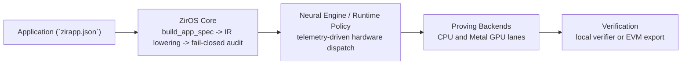

# ZirOS: The Zero-Knowledge Operating System

Automating Truth. Prove anything. Trust nothing. Run everywhere.

## The Agentic Thesis: Formal Verification as the API

ZirOS is built for autonomous operators. A Claude, Codex, Manus, or in-house
agent should not need a PhD in pairing cryptography to ship a safe proof
application. It should need three things:

1. deterministic commands,
2. structured JSON outputs,
3. a fail-closed audit surface that explains exactly what went wrong and how to
   fix it.

That is the core thesis of ZirOS: formal verification is the interface. An
agent does not need to be trusted because the math is the authority. The Lean
and Coq proof surfaces, the audited IR lowering pipeline, and the fail-closed
runtime checks are designed so an insecure circuit is rejected before it
becomes a build artifact.

In practice that means an agent can scaffold an application, run the audit,
read a machine-readable failure, apply the correction, and keep going. If it
forgets nonlinear anchoring, the audit stops it. If it asks for an unsupported
strict lane, the runtime stops it. If it drifts from the attested GPU path, the
verified Metal boundary stops it.

Concrete example: a scientist asks their agent to prove that clinical-trial
records satisfy an FDA threshold without exposing patient data. The agent
scaffolds the app, hits an audit failure for underconstrained signals, reads the
plain-English remediation, routes the private values through a Poseidon anchor,
passes the audit, and deploys the Solidity verifier. On an Apple Silicon
MacBook, that is intended to be a normal workflow, not an expert-only stunt.

## What Is ZirOS?

ZirOS is not a library and it is not just a framework. It is the operating
system layer that sits between application logic and raw proving machinery.

Applications describe intent in `zirapp.json` or through `ProgramBuilder`.
ZirOS then owns the rest of the path:

- IR lowering and normalization
- fail-closed audit and underconstraint detection
- witness generation and witness safety checks
- backend selection and trust-lane routing
- CPU vs GPU scheduling
- Metal pipeline dispatch
- telemetry and Neural Engine policy inputs
- swarm coordination and peer reputation
- verifier export and deployment packaging

That makes the repository opinionated in the right place. Developers and agents
author the statement they want proven. ZirOS handles the cryptographic
plumbing, the hardware policy, the safety rails, and the release artifacts.

## The Apple Silicon Rationale

ZirOS targets Apple Silicon as its primary execution environment because the
hardware matches zero-knowledge proving workloads unusually well.

- Unified Memory Architecture (UMA) removes the usual CPU↔GPU copy boundary and
  enables zero-copy data movement across proving stages.
- M-series Max chips reach memory bandwidth figures up to roughly 800 GB/s,
  which matters for memory-bound kernels such as MSM and NTT.
- The repo ships Metal acceleration and keeps a prewarmed pipeline inventory on
  the certified host lane. The current Apple Silicon path includes 14 prewarmed
  Metal GPU pipelines and AOT-compiled shaders.
- Metal avoids the traditional PCIe-bound discrete GPU latency profile. For the
  proving path ZirOS cares about, that lowers dispatch overhead and keeps the
  scheduler policy simple and deterministic.

Apple Silicon is therefore not just a convenient supported target. It is the
machine ZirOS is shaped around.

## System Architecture



The control flow above is backed by explicit crate boundaries:

- `zkf-lib` and `zkf-cli` expose the application and operator surfaces.
- `zkf-core` defines IR, witness generation, field arithmetic, and audits.
- `zkf-backends` owns compile/prove/verify per backend.
- `zkf-runtime` owns UMPG planning, scheduling, telemetry, and policy.
- `zkf-metal` owns the Apple GPU path and attested dispatch surfaces.
- `zkf-distributed` and `zkf-runtime` own cluster/swarm coordination.

## Fail-Closed Audit

The audit system runs before proving and is designed to reject ambiguity, not to
comment on it politely.

It computes linear rank and matrix nullity over the circuit surface, then asks a
stronger question: does every private signal participate in a nonlinear
relation that actually constrains it? If the answer is no, ZirOS fails closed.

That is how ZirOS blocks the classic underconstrained-signal failure mode. A
signal that only appears in addition, subtraction, or equality constraints may
still be movable by a malicious prover. ZirOS refuses to compile that program
until the signal is anchored through a nonlinear operation such as a Poseidon
hash, a boolean constraint, or a multiplication gate.

See [`docs/NONLINEAR_ANCHORING.md`](docs/NONLINEAR_ANCHORING.md).

## The Swarm And Neural Engine

### Swarm

The swarm surface coordinates distributed proving and defensive runtime policy.
It tracks peer reputation, persists a reputation log, supports anomaly
detection, and exposes operational controls through `zkf-cli swarm ...`.

Swarm logic is allowed to change scheduling and rejection posture. It is not
allowed to change circuit semantics, witness semantics, or verifier truth.

### Neural Engine

The Neural Engine path is the control plane, not the proof plane. It consumes
telemetry and runtime context to recommend the best hardware route for a job:
CPU, Metal GPU, or a stricter certified lane. Proof validity never depends on
the model. Dispatch policy may depend on the model. Proof truth does not.

## Supported Backends And Frontends

### Primary Backends

| Backend ID | Friendly Name | Field(s) | Trusted Setup | Primary Use Case |
| --- | --- | --- | --- | --- |
| `arkworks-groth16` | Arkworks Groth16 | BN254 | Yes | Smallest proofs, cheapest EVM verification, direct Solidity export |
| `plonky3` | Plonky3 STARK | Goldilocks, BabyBear, Mersenne31 | No | Transparent default path for first proofs and Metal-accelerated STARK proving |
| `halo2` | Halo2 IPA | Pasta Fp | No | Transparent Plonkish proving with local verification and Pasta-field circuits |
| `halo2-bls12-381` | Halo2 KZG | BLS12-381 | Yes | BLS12-381 KZG lane where trusted setup is acceptable |
| `nova` | Nova | BN254-facing recursive shell | No ceremony in the ZirOS recursive shell | Incremental proving and recursive folding workflows |
| `hypernova` | HyperNova | BN254-facing recursive shell | No ceremony in the ZirOS recursive shell | Higher-throughput multifolding workflows |
| `midnight-compact` | Midnight Compact | Pasta Fp, Pasta Fq | External / delegated | Compact proof-server workflows; live support matrix currently marks this lane unconfigured |

The live support matrix for this checkout is
[`support-matrix.json`](support-matrix.json).

### Frontends

- Noir
- Circom
- Cairo
- Compact
- Halo2-Rust
- Plonky3-AIR
- zkVM

## Quick Start

Prebuilt install:

```bash
curl -sSf https://zkf.dev/install.sh | sh
export PATH="$HOME/.zkf/bin:$PATH"
ziros doctor
```

Source build from a fresh clone:

```bash
git clone git@github.com:anubisquantumcipher/ziros.git
cd ziros
./install.sh
zkf-cli app init --template range-proof --name quickstart --out /tmp/quickstart
cargo test --manifest-path /tmp/quickstart/Cargo.toml --quiet
cargo run --manifest-path /tmp/quickstart/Cargo.toml --quiet
```

Direct CLI path from `zirapp.json` to a verified proof:

```bash
./target-local/release/zkf-cli compile --spec /tmp/quickstart/zirapp.json --backend plonky3 --out /tmp/quickstart/compiled.json
./target-local/release/zkf-cli prove --program /tmp/quickstart/zirapp.json --inputs /tmp/quickstart/inputs.compliant.json --out /tmp/quickstart/proof.json
./target-local/release/zkf-cli verify --program /tmp/quickstart/zirapp.json --artifact /tmp/quickstart/proof.json --backend plonky3
```

For the full EPA walkthrough, see
[`docs/GETTING_STARTED.md`](docs/GETTING_STARTED.md).
