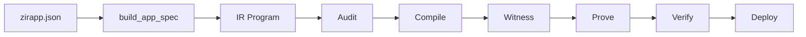

# ZirOS Architecture

Live truth remains the verification ledger, completion status, canonical truth
doc, and support matrix. This file explains how the shipped execution path fits
together.

## End-To-End Data Flow

## Step Semantics

- `zirapp.json`: the high-level application spec. This is the agent-facing
  authoring surface for signals, operations, sample inputs, and metadata.
- `build_app_spec`: lowers app-spec operations into the canonical IR program.
- `IR Program`: the normalized circuit representation consumed by backends.
- `Audit`: fail-closed structural checks, including backend compatibility,
  underconstraint detection, matrix nullity, and nonlinear anchoring.
- `Compile`: backend-specific synthesis and setup generation.
- `Witness`: witness generation, witness completeness, and constraint checks.
- `Prove`: backend proof generation on CPU or Metal GPU lanes.
- `Verify`: local verification or a wrapped/exported verification surface.
- `Deploy`: Solidity verifier export for EVM-oriented flows.

## Core Components

- `zkf-core`: IR, witness generation, field arithmetic, audits.
- `zkf-lib`: in-process application API.
- `zkf-cli`: operator CLI.
- `zkf-backends`: compile/prove/verify implementations.
- `zkf-runtime`: UMPG planning, runtime policy, telemetry.
- `zkf-metal`: Apple Silicon GPU execution and attestation.
- `zkf-distributed`: cluster and swarm coordination.

## Operational Notes

- Program-consuming CLI commands now accept `zirapp.json` directly through the
  shared loader.
- The audit stage is intentionally earlier than compile, because ZirOS treats an
  unsafe circuit as a build error, not as a warning.
- Verification is isolated from witness data. Proofs verify only against the
  compiled verification surface and public inputs.
