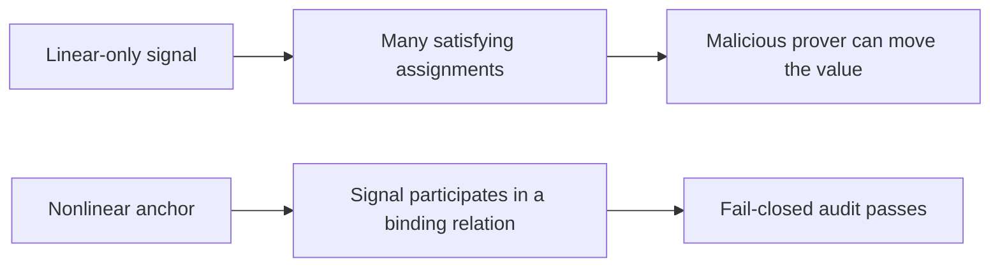

# Nonlinear Anchoring

## The Short Version

If a private signal only appears in linear relations, a malicious prover may be
able to change that signal and still satisfy the circuit. ZirOS calls this out
and rejects the program until the signal is anchored through a nonlinear
relation.

## Linear Vs Nonlinear Constraints

Linear constraints use only addition, subtraction, and equality.

```text
a + b = c
x - y = 0
out = value
```

Nonlinear constraints multiply signal values together or route them through a
nonlinear gadget.

```text
b * d = anchor
flag * (1 - flag) = 0
Poseidon(secret, salt, ...)
```



## Why ZirOS Requires It

The audit computes linear rank and nullity. If a private signal lives inside a
free linear subspace and never enters a nonlinear relation, the circuit may be
mathematically incomplete even if it looks plausible to a human reviewer.

ZirOS therefore treats nonlinear anchoring as a safety property, not an
optimization.

## Why `range` Is Still Treated Conservatively

Range checks are implemented by decomposing a value into intermediate bits and
constraining those intermediates. Those bit constraints are individually
nonlinear, but from the perspective of the original private signal, the system
can still behave like a linear relation if the anchored object is only an
intermediate bit decomposition and the top-level signal never participates in a
binding nonlinear relation of its own.

That is why the audit stays conservative. A range check is useful. It is not a
blanket substitute for a real anchor on every private signal you care about.

## Three Standard Fixes

### 1. Route the signal through Poseidon

Use this when you need a commitment anyway.

```text
commitment = Poseidon(secret, salt, ...)
```

### 2. Apply a boolean constraint

Use this when the signal is supposed to be a bit or selector.

```text
flag * (1 - flag) = 0
```

### 3. Use a multiplication gate

Use this when the signal participates in arithmetic semantics.

```text
anchor = left * right
```

## Worked Example

### Vulnerable

```text
lead_gap = lead_max - lead_ppb
temperature_gap = temp_max - temperature_c
```

Both signals are derived through subtraction only. A prover may be able to move
them inside a linear solution space.

### Fixed

```text
lead_gap = lead_max - lead_ppb
temperature_gap = temp_max - temperature_c
commitment = Poseidon(lead_ppb, temperature_c, lead_gap, temperature_gap)
```

Now the private values and their derived gaps participate in a nonlinear
binding relation.

## What The Error Means

When ZirOS says a signal is “only used in linear constraints and is linearly
underdetermined without nonlinear anchoring,” it means:

- the signal affects the circuit,
- but only through linear equations,
- so the circuit does not yet bind that value tightly enough.

The fix is to anchor it, not to ignore the audit.
